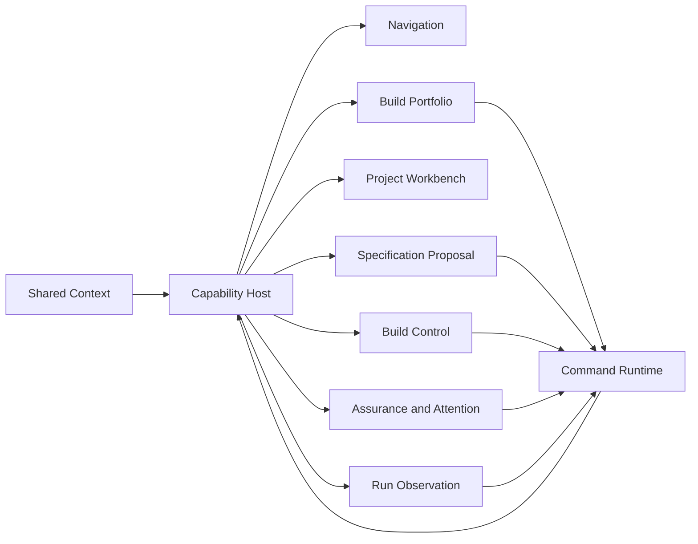

# Developer Control Capability Architecture

**Status**: Active
**Date**: 2026-07-11
**Scope**: Cross-tenant capability, contract, ownership, and integration design
**Governance**: STDO Method, ODD Method, STDO-UX Method
**Ticket**: T-032, sprint W15
**Derives From**:
- `specification/INTENT.md`
- `specification/PRODUCT.md`
- `specification/domain/DOMAIN_MODEL.md`
- `specification/requirements/11-developer-portfolio-and-project-workbench.md`
- `specification/requirements/12-specification-proposal-and-change-control.md`
- `specification/requirements/13-build-admission-and-supervision.md`
- `specification/requirements/14-gate-asset-assurance-and-attention.md`
- `specification/requirements/15-modular-capability-composition.md`
- `.ai-workspace/comments/operator/20260711T025804Z_STRATEGY_modular-integrated-developer-control-capabilities.md`

## 1. Purpose

This design defines the clean boundaries through which `odd_manager` composes
its first developer experience:

```text
Review -> Tune -> Build -> Assure
```

It makes each major capability independently evolvable while preserving one
Project Context, one command/effect membrane, one source-reference vocabulary,
and one integrated developer journey.

This design does not make unavailable constructive carriers appear available.
Capability availability is derived from admitted contracts. A missing carrier
disables only the affected action family.

## 2. Design Decisions

1. Major product capabilities are modules, not sections inside one component.
2. The Project Workbench is a thin composition host, not a semantic center.
3. A capability owns its State, Msg, Update, Cmd, Sub, selectors, view, ingress,
   and local proof.
4. The host owns shared Context, capability registration, command dispatch,
   subscription delivery, navigation, and integration replay.
5. Capabilities communicate through shared typed contracts and host messages.
   They do not import, read, or mutate one another's internals.
6. Product-truth-changing messages produce typed commands against admitted
   carriers. A view never constructs filesystem writes, process argv, or
   runtime policy.
7. Existing AI Workspace and Run Inspector cross the same module boundary
   without changing GTL/ABG ownership.
8. Wave 1 establishes structure and one read-only integration proof. Functional
   MVPs follow as separate capability iterations.

## 3. Capability Topology



Dependency direction:

```text
shared contracts and UI primitives
  <- capability modules
  <- capability host
  <- route/application shell
```

A capability cannot import another capability. The host imports only each
capability's public contribution module.

## 4. Capability Ownership

| Capability | Owns | Does not own |
| --- | --- | --- |
| Build Portfolio | Registered-Project discovery and mutation, explicit Project activation, cross-Project readiness, build summary, freshness, queue and attention projection | Project source, build process, ABG runtime, capability editing state |
| Project Workbench | Composition, goal phase, local capability focus, supporting drill navigation | Capability reducers, command decisions, product/domain rules |
| Specification Proposal | Proposal drafts, context attachments, validation, diff, acceptance workflow and history | Unreviewed source mutation, build execution, runtime continuation |
| Build Control | Build carrier availability, request admission, execution lifecycle, correlation and bounded process commands | Graph traversal, evidence admission, runtime closure, domain gate meaning |
| Assurance and Attention | Gate/asset assessment, evidence drilldown, attention projection and lawful reactions | Invented gate meaning, silent repair, process lifecycle |
| Run Observation | ABG/GTL run, graph, traversal, event, proof and artifact observation | Build queue, proposal state, operator scheduling |

## 5. Shared Contract Kernel

The shared contract kernel contains only identities and envelopes required by
more than one capability. It is not a common dumping ground.

### 5.1 Identity contracts

```ts
type ProjectRef = {
  id: string;
  root: string;
  publishedProductRef: string | null;
};

type ProjectRevision = {
  kind: 'commit' | 'worktree' | 'snapshot';
  revision: string;
  dirty: boolean;
  sourceDigest: string | null;
  specificationDigest: string | null;
  observedAt: string;
};

type ManagerContext = {
  project: ProjectRef;
  workspaceRef: string | null;
  revision: ProjectRevision | null;
};
```

ProjectRevision is immutable once attached to a proposal or build. A newer
portfolio observation creates a new value; it does not rewrite prior basis.

### 5.2 Capability contribution

```ts
type CapabilityId =
  | 'build-portfolio'
  | 'project-workbench'
  | 'specification-proposal'
  | 'build-control'
  | 'assurance-attention'
  | 'run-observation';

type CapabilityAvailability =
  | { kind: 'unavailable'; reason: string; missingRefs: string[] }
  | { kind: 'loading' }
  | { kind: 'ready'; contractRefs: string[] }
  | { kind: 'stale'; reason: string; observedAt: string }
  | { kind: 'unsupported'; reason: string; sourceRefs: string[] }
  | { kind: 'error'; error: string; sourceRefs: string[] };

type CapabilityContribution = {
  id: CapabilityId;
  label: string;
  summary: string;
  implementationStage: 'structural' | 'mvp';
  requiredContractRefs: string[];
  availability: CapabilityAvailability;
  defaultRoute: string;
  attentionCount: number;
};
```

Availability is not completion. A ready module can still show an empty,
blocked, failed, or non-converged product state.

### 5.3 Command envelope

```ts
type CommandEnvelope<K extends string, P> = {
  schemaVersion: '1';
  commandId: string;
  correlationId: string;
  capabilityId: CapabilityId;
  kind: K;
  context: ManagerContext;
  requestedBy: string;
  requestedAt: string;
  payload: P;
};

type CommandResult<T> =
  | {
      status: 'succeeded';
      commandId: string;
      correlationId: string;
      completedAt: string;
      value: T;
      sourceRefs: string[];
    }
  | {
      status: 'failed';
      commandId: string;
      correlationId: string;
      completedAt: string;
      failureKind: string;
      error: string;
      sourceRefs: string[];
      retryable: boolean;
    };
```

The host mints command identity and rejects results whose command, correlation,
Project, or revision basis does not match a pending command.

## 6. Product Contracts

### 6.1 Specification proposal

```ts
type SpecificationProposal = {
  schemaVersion: '1';
  proposalId: string;
  project: ProjectRef;
  basisRevision: ProjectRevision;
  participantRef: string;
  createdAt: string;
  status: 'draft' | 'validating' | 'valid' | 'invalid' | 'stale' |
    'accepted' | 'rejected' | 'superseded';
  contextAttachments: SourceAttachment[];
  patch: UnifiedPatch;
  validation: ValidationResult[];
  affectedSurfaceRefs: string[];
  predecessorProposalId: string | null;
  resultingRevision: ProjectRevision | null;
  decision: AttributedDecision | null;
};
```

Product commands:

| Command | Success Msg | Failure Msg | Carrier status |
| --- | --- | --- | --- |
| `proposal.generate` | `proposal/generated` | `proposal/generate-failed` | new manager carrier required |
| `proposal.validate` | `proposal/validated` | `proposal/validation-failed` | new manager carrier required |
| `proposal.accept` | `proposal/accepted` | `proposal/accept-failed` | new manager carrier required |
| `proposal.reject` | `proposal/rejected` | `proposal/reject-failed` | new manager carrier required |

The acceptance carrier must check the basis revision immediately before an
atomic apply and must produce the resulting revision. Until that carrier is
admitted, proposal acceptance availability is `unavailable`.

### 6.2 Build carrier descriptor

The selected product/domain package publishes a descriptor. The manager never
accepts arbitrary executable paths or argv from the view.

```ts
type BuildCarrierDescriptor = {
  schemaVersion: '1';
  descriptorRef: string;
  productRef: string;
  productVersion: string;
  carrierKind: 'job' | 'graph_function' | 'workorder';
  carrierRef: string;
  startupConfigRef: string;
  publicStartTarget: string;
  inputSchemaRef: string;
  worksiteProvisionerRef: string;
  executionAdapterRef: string;
  supportedCommands: Array<'submit' | 'attach' | 'cancel' | 'resume'>;
  requirementCatalogRefs: string[];
  expectedAssetCatalogRefs: string[];
  proofRefs: string[];
};
```

`worksiteProvisionerRef` and `executionAdapterRef` resolve through an
allowlisted server-side adapter registry. They are identities, not paths or
commands supplied by the browser.

### 6.3 Build request and execution

```ts
type BuildRequest = {
  schemaVersion: '1';
  requestId: string;
  correlationId: string;
  project: ProjectRef;
  revision: ProjectRevision;
  descriptorRef: string;
  carrierRef: string;
  startupConfigRef: string;
  publicStartTarget: string;
  inputs: unknown;
  requestedBy: string;
  requestedAt: string;
  resourcePolicyRef: string;
  authorityRefs: string[];
};

type BuildExecutionState =
  | 'queued'
  | 'starting'
  | 'running'
  | 'waiting_human'
  | 'converged'
  | 'failed'
  | 'cancelled'
  | 'stale'
  | 'disconnected';

type BuildExecution = {
  schemaVersion: '1';
  executionId: string;
  requestId: string;
  correlationId: string;
  project: ProjectRef;
  revision: ProjectRevision;
  state: BuildExecutionState;
  queuePosition: number | null;
  processRef: string | null;
  runRefs: string[];
  startedAt: string | null;
  updatedAt: string;
  completedAt: string | null;
  heartbeatAt: string | null;
  processOutcome: ProcessOutcome | null;
  assuranceSummaryRef: string | null;
  sourceRefs: string[];
};
```

Product commands:

| Command | Success Msg | Failure Msg | Carrier status |
| --- | --- | --- | --- |
| `build.submit` | `build/admitted` | `build/admission-failed` | blocked pending complete descriptor/worksite carrier |
| `build.attach` | `build/attached` | `build/attach-failed` | blocked pending supervisor |
| `build.cancel` | `build/cancelled` | `build/cancel-failed` | blocked pending supervisor |
| `build.retry` | `build/retry-admitted` | `build/retry-rejected` | policy and carrier dependent |
| `build.human-decision` | `build/human-decision-admitted` | `build/human-decision-rejected` | ABG command boundary dependent |

### 6.4 Assurance and attention

```ts
type GateAssessment = {
  gateRef: string;
  project: ProjectRef;
  revision: ProjectRevision;
  executionId: string;
  regime: 'F_D' | 'F_P' | 'F_H';
  status: 'required' | 'satisfied' | 'failed' | 'missing' | 'stale' |
    'unsupported' | 'waiting_human';
  evidenceRefs: string[];
  sourceRefs: string[];
  assessedAt: string;
};

type AssetDelivery = {
  requirementRef: string;
  artifactRef: string | null;
  project: ProjectRef;
  revision: ProjectRevision;
  executionId: string;
  status: 'expected' | 'delivered' | 'failed' | 'missing' | 'stale' |
    'unsupported';
  producerRef: string | null;
  digest: string | null;
  evidenceRefs: string[];
  sourceRefs: string[];
};

type AttentionItem = {
  attentionId: string;
  correlationId: string;
  project: ProjectRef;
  executionId: string | null;
  sourceKind: string;
  sourceRef: string;
  severity: 'info' | 'warning' | 'blocking';
  reason: string;
  observedAt: string;
  reactions: LawfulReaction[];
};
```

Assurance is a projection over admitted evidence. Attention reactions create
commands or navigation messages; they do not mutate the source condition.

## 7. STDO-UX Module Contract

Each capability publishes this logical interface:

```ts
type CapabilityModule<State, Msg, Cmd, Sub> = {
  id: CapabilityId;
  initialState: State;
  update: (state: State, msg: Msg) => { state: State; commands: Cmd[] };
  subscriptions: (state: State, context: ManagerContext) => Sub[];
  contribution: (state: State, context: ManagerContext) => CapabilityContribution;
  view: CapabilityView<State, Msg>;
};
```

The concrete TypeScript interface is tenant-local. The invariants are not:

- Update is pure.
- View dispatches Msg only.
- Cmd names one effect and one admitted carrier.
- Sub names one external event source.
- ingress validates before success Msg admission.
- each command has explicit success and failure Msg variants.
- state that affects another view or survives unmount belongs in module or host
  State, not component-local state.

## 8. Host Messages And Effects

The host owns only integration messages:

| Host Msg | Meaning |
| --- | --- |
| `host/context-requested` | Request exact registered Project Context |
| `host/context-admitted` | Admit validated Context and revision |
| `host/context-failed` | Preserve current Context and expose failure |
| `host/capability-registered` | Admit one capability contribution |
| `host/command-enqueued` | Admit a typed command envelope |
| `host/command-succeeded` | Route validated result to owning capability |
| `host/command-failed` | Route validated failure to owning capability |
| `host/subscription-event` | Route validated external event by owner/correlation |
| `host/navigation-requested` | Change visible focus without changing product truth |

The host does not branch on proposal, build, assurance, or runtime domain
meaning. That branching stays in the owning capability reducer.

### 8.1 Project Browser ownership

The original Sidecar Project Browser was an early workbench. From W17, its
cross-Project responsibility belongs to Build Portfolio. There is one registry
browser and one explicit activation path. Sidecar keeps Project-local files,
tickets, comments, shells, AI Workspace, Run Inspector, and Recent Paths; it
does not expose a second Project selector or registry mutation path.

## 9. Carrier Census

### 9.1 Current odd_manager surfaces

| Surface | Current availability | W15 ruling |
| --- | --- | --- |
| Project registry and active Project | admitted read/write API | reusable through host Context port |
| Project deep link | admitted exact-registry path | change default contribution to Project Workbench in W16 |
| Source/specification file read | generic filesystem surface | supporting observation only |
| Specification proposal history | absent | new manager carrier required |
| Proposal validate/accept/reject | absent | action remains unavailable until W18 carrier |
| Durable shells | admitted session carrier | remains generic tool, never Build fallback |
| AI Workspace observation | admitted typed projection | migrate behind Run Observation contribution |
| Run Inspector and Traversal | admitted typed projection | migrate behind Run Observation contribution |
| Build request/supervisor | absent | action remains unavailable until W19 carrier |
| Gate/asset observation | partial from run proof | usable for read-only W16 summary; requirement catalog needed for full W21 assurance |

### 9.2 odd_glc and ABIogenesis build carrier

Published and usable declaration inputs:

- `ODD_GLC_SOFTWARE_BUILD_OVERLAY`;
- `ODD_GLC_SOFTWARE_BUILD_GRAPH_FUNCTION_BINDINGS`;
- `ODD_GLC_SOFTWARE_BUILD_STARTUP_BINDING`;
- public start targets including
  `graph-function://odd_glc/software-build/full-lifecycle`;
- ABIogenesis `genesis-ts start` with declared workspace, scope, target, until,
  F_H/root modes, allowlist, model, sandbox, live-agent, timeout, and executor
  profile arguments;
- structured CLI output containing resolved graph function, stop class,
  control outcome, live capability, event kinds, and event-log path.

Missing complete manager-callable carrier:

- no published odd_glc `BuildCarrierDescriptor`;
- no product command that provisions an immutable build worksite from a selected
  Project Revision;
- no reusable declarations-only runtime binding at the selected source Project;
- no public odd_glc execution adapter for submit/attach/cancel/resume;
- the current data-mapper runner is a `node:test` proof harness that installs a
  sandbox, writes scenario-specific runtime binding code, and then invokes
  `genesis-ts start`;
- odd_glc T-033 explicitly records that the current generated binding still
  owns mechanisms that must migrate to the standard declarations-only path.

Ruling:

```text
declaration carrier: available
ABG start command: available
complete manager-callable build carrier: unavailable
```

W16 may expose this availability honestly and may compose existing read-only
run evidence. W19 cannot implement `build.submit` against the test harness. It
depends on odd_glc T-033 plus a published descriptor/adapter satisfying this
design.

## 10. Structural Wave Target

The React tenant establishes this shape before functional MVP work:

```text
src/
  capabilities/
    host/
    build-portfolio/
    project-workbench/
    specification-proposal/
    build-control/
    assurance-attention/
    run-observation/
  contracts/
    developer-control/
  effects/
    command-runtime/
  components/
    primitives/
```

Each capability directory owns public `index`, state, messages, update,
selectors, contribution, view, and tests. Ingress and effect adapters may live
beside the capability when capability-specific or under the shared command
runtime when genuinely generic.

The existing Sidecar remains an adapter during Wave 1. Its Project registry,
shell, file, ticket, AI Workspace, and Run Inspector behavior is decomposed
through capability public ports. New developer-control behavior does not enter
`SidecarPanel.tsx` or a replacement monolith.

## 11. Integration And Dependency Proof

Wave 1 requires:

1. module replay for each capability shell;
2. integration replay for Project Context admission and stale-result rejection;
3. integration replay for command enqueue, success, failure, and correlation;
4. navigation replay from Project deep link to Project Workbench and supporting
   Run Observation;
5. structural dependency test that rejects capability-to-capability internal
   imports;
6. structural size/ownership review preventing a new central semantic
   component;
7. current T-031 observation runtime and browser proof remaining green.

## 12. Failure Semantics

- Unknown or malformed ingress becomes capability `error`, never partial state.
- Missing carrier becomes `unavailable` or `unsupported`, never a hidden shell
  fallback.
- Project/revision mismatch rejects late success and subscription events.
- Command failure remains attached to its source action and does not clear the
  underlying attention condition.
- Host failure cannot be reinterpreted as capability-domain failure.
- Process outcome cannot establish assurance.
- Capability structural readiness cannot establish functional MVP completion.

## 13. Design-To-Module Proof Map

| Design boundary | W16 module | Required proof |
| --- | --- | --- |
| Shared Context and revision | `capabilities/host` plus shared contracts | context admission and stale-result replay |
| Capability registration | `capabilities/host` | duplicate/unknown registration rejection |
| Command membrane | `effects/command-runtime` | success/failure/correlation replay |
| Portfolio shell | `capabilities/build-portfolio` | read-only multi-Project projection fixture |
| Workbench composition | `capabilities/project-workbench` | contribution composition and focus replay |
| Proposal shell | `capabilities/specification-proposal` | unavailable state and no-write negative proof |
| Build shell | `capabilities/build-control` | missing-descriptor fail-closed proof |
| Assurance shell | `capabilities/assurance-attention` | read-only evidence summary and no-green-without-evidence proof |
| Run observation adapter | `capabilities/run-observation` | existing AI Workspace/Run Inspector projection parity |
| Dependency direction | tenant source graph | forbidden internal import test |

## 14. Non-Closure Conditions

- capability modules are only visual folders around shared mutable state;
- the host owns capability-specific decisions;
- capabilities call one another's services or reducers directly;
- a view or effect handler constructs build argv or writes specification;
- odd_glc's live test harness is exposed as the Build carrier;
- unavailable proposal/build actions are rendered as operational controls;
- current observation behavior regresses during structural extraction;
- Wave 1 is represented as a functional MVP.
