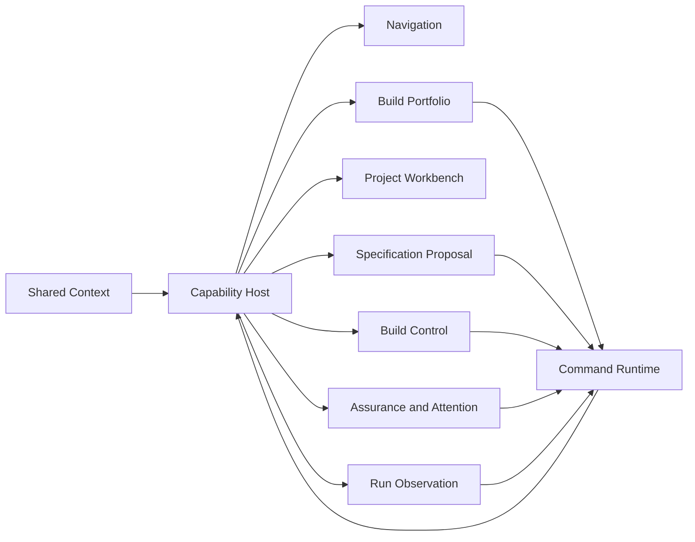
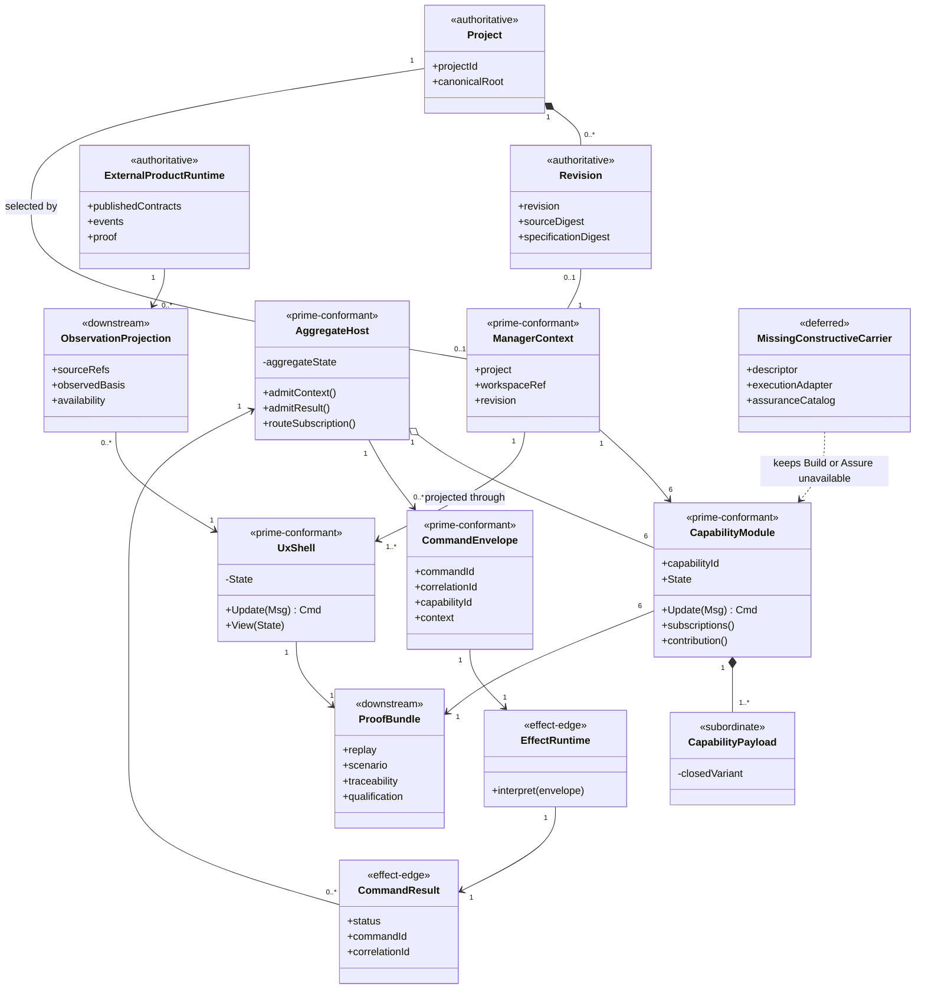
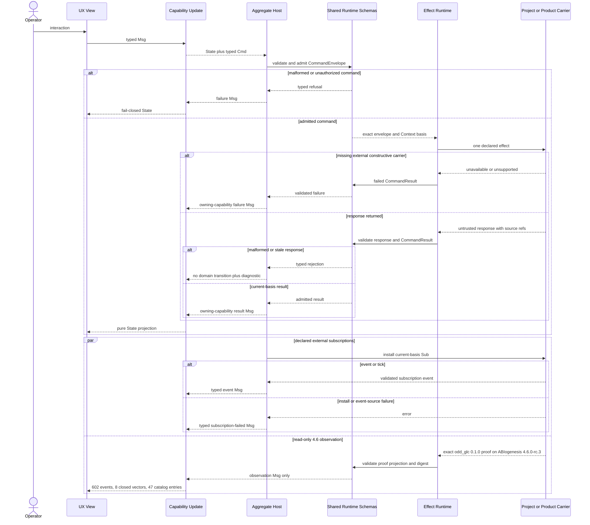
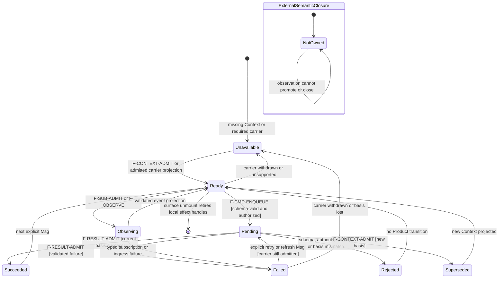

# Developer Control Capability Architecture

**Status**: Active
**Date**: 2026-07-11
**Scope**: Cross-tenant capability, contract, ownership, and integration design
**Governance**: STDO Method, ODD Method, STDO-UX Method
**Ticket**: T-032, sprint W15
**Implements**: `PO-OM-BOUNDARY-001`; `PO-OM-DEVELOPER-001`; `PO-OM-MODULES-001`; `PO-OM-AUDIT-001`; `REQ-OM-VER-*`; `REQ-OM-DEV-*`; `REQ-OM-SPC-*`; `REQ-OM-BLD-*`; `REQ-OM-ASR-*`; `REQ-OM-CAP-*`
**Code Entrypoints**: `build_tenants/react_vite/src/capabilities/host/aggregate.ts`; `build_tenants/react_vite/src/capabilities/host/DeveloperControlHost.tsx`; `build_tenants/react_vite/src/effects/command-runtime/developer-control-aggregate-runtime.ts`; `build_tenants/react_vite/src/contracts/developer-control/index.ts`; `build_tenants/react_vite/packages/developer-control-contracts/src/index.ts`
**Executable Proof**: `build_tenants/react_vite/runtime/tests/test_developer_control_bootstrap.mjs` :: `developer control bootstrap publishes six schema-valid capability contributions`; `build_tenants/react_vite/runtime/tests/test_developer_control_capability_host.mjs` :: `aggregate Project switch retires prior Project work and ignores a late proposal completion`; `build_tenants/react_vite/runtime/tests/test_developer_control_capability_host.mjs` :: `aggregate Project switch preserves only target-Project attention through Context admission`; `build_tenants/react_vite/runtime/tests/test_developer_control_capability_host.mjs` :: `aggregate result admission binds the outer command to the exact inner identity`; `build_tenants/react_vite/runtime/tests/test_developer_control_capability_host.mjs` :: `each capability owns its structural public surfaces and cross-capability imports stay at host ports`; `build_tenants/react_vite/runtime/tests/test_app_shell_replay.mjs` :: `App shell correlates bootstrap effects and replays an admitted active deep link`; `build_tenants/react_vite/runtime/tests/test_sidecar_msg_replay.mjs` :: `cross-Project recent-path activation is a typed effect and opens only after the target Context loads`; `build_tenants/react_vite/runtime/tests/test_sidecar_msg_replay.mjs` :: `same-root load generations reject older success and failure projections`; `build_tenants/react_vite/runtime/tests/test_sidecar_msg_replay.mjs` :: `Sidecar action results retain exact command and Context identity through terminal admission`; `build_tenants/react_vite/runtime/tests/test_sidecar_msg_replay.mjs` :: `Project transition retires Project-A action results before Project B becomes current`; `build_tenants/react_vite/runtime/tests/test_odd_glc_010_abg_460_rc3_read_only_observation.mjs` :: `exact odd_glc 0.1.0 / ABIogenesis 4.6.0-rc.3 read-only observation qualifies while Build remains unavailable`; `build_tenants/react_vite/qualification/installed-development-proof.mjs` :: `isolated development candidate proves the declared operator significant-path bundle`
**STDO-UX Bindings**: State=DeveloperControlAggregateState plus capability-owned State records and replayable App/Sidecar shell states; Msg=DeveloperControlAggregateMessage plus capability and shell Msg unions; Update=updateDeveloperControlAggregate plus capability and shell update functions; Cmd=DeveloperControlAggregateCommand plus capability and shell command unions; Sub=DeveloperControlAggregateSubscription plus declared shell, timer, event-source, and terminal attachment subscriptions; Ingress=developer-control-contracts Zod schemas, dedicated observation/storage/websocket validators, and bootstrap admission; View=DeveloperControlHost plus registered capability and supporting shell Views; Membrane=developer-control-aggregate-runtime plus thin command/subscription and shell effect adapters; Replay=build_tenants/react_vite/runtime/tests/test_developer_control_capability_host.mjs :: aggregate replay owns cross-capability command lifecycle and admitted run focus; Accessibility=build_tenants/react_vite/tests/e2e/odd-manager-accessibility.spec.ts :: developer-control status, custom tabs, and representative text/control tokens meet keyboard and AA expectations
**Accessibility Proof Scope**: Public capability and supporting observation proof covers native/custom keyboard parity, focus handoff and recovery, named panels and live status, representative WCAG AA text/control pairs, terminal and forensic navigation, and desktop/390px containment. No stricter automated-axe or screen-reader certification is claimed by Product.
**Current Implementation Gap**: No unresolved manager-local relation remains in `B-OM-DEVCTRL-LOCAL-001` after the exact candidate passes section 26 validation. The separate odd_glc Build Carrier Descriptor, execution adapter, Assurance Catalog, evidence bundle, and live Build/Assure steel thread remain outside this accepted local boundary.
**Design-Method Acceptance**: `ONT-OM-DEVCTRL-001` and the design for `B-OM-DEVCTRL-LOCAL-001` are accepted under sections 15-26, conditional on the exact deterministic candidate validation recorded by T-032. This acceptance does not close T-032's external functional residual.
**Derives From**:
- `specification/INTENT.md`
- `specification/PRODUCT.md`
- `specification/domain/DOMAIN_MODEL.md`
- `specification/requirements/11-developer-portfolio-and-project-workbench.md`
- `specification/requirements/12-specification-proposal-and-change-control.md`
- `specification/requirements/13-build-admission-and-supervision.md`
- `specification/requirements/14-gate-asset-assurance-and-attention.md`
- `specification/requirements/15-modular-capability-composition.md`
- `.ai-workspace/comments/operator/20260711T025804Z_STRATEGY_modular-integrated-developer-control-capabilities.md`

## 1. Purpose

This design defines the clean boundaries through which `odd_manager` composes
its first developer experience:

```text
Review -> Tune -> Build -> Assure
```

It makes each major capability independently evolvable while preserving one
Project Context, one shared aggregate command/result seam for post-Context
capability effects, named application-shell and Sidecar effect membranes, one
source-reference vocabulary, and one integrated developer journey.

This design does not make unavailable constructive carriers appear available.
Capability availability is derived from admitted contracts. A missing carrier
disables only the affected action family.

## 2. Design Decisions

1. Major product capabilities are modules, not sections inside one component.
2. The Project Workbench is a thin composition host, not a semantic center.
3. A capability owns its State, Msg, Update, Cmd, Sub, selectors, view, ingress,
   and local proof.
4. The host owns shared Context, capability registration, command dispatch,
   subscription delivery, navigation, and integration replay.
5. Capabilities communicate through shared typed contracts and host messages.
   They do not import, read, or mutate one another's internals.
6. Product-truth-changing messages produce typed commands against admitted
   carriers. A view never constructs filesystem writes, process argv, or
   runtime policy.
7. Existing AI Workspace and Run Inspector cross the same module boundary
   without changing GTL/ABG ownership.
8. Wave 1 establishes structure and one read-only integration proof. Functional
   MVPs follow as separate capability iterations.

## 3. Capability Topology


```mermaid
flowchart LR
  Host[Capability Host]
  Context[Shared Context]
  Command[Command Runtime]
  Nav[Navigation]

  Portfolio[Build Portfolio]
  Workbench[Project Workbench]
  Proposal[Specification Proposal]
  Build[Build Control]
  Assurance[Assurance and Attention]
  Run[Run Observation]

  Context --> Host
  Host --> Portfolio
  Host --> Workbench
  Host --> Proposal
  Host --> Build
  Host --> Assurance
  Host --> Run

  Portfolio --> Command
  Proposal --> Command
  Build --> Command
  Assurance --> Command
  Run --> Command
  Command --> Host
  Host --> Nav
```

Dependency direction:

```text
shared contracts and UI primitives
  <- capability modules
  <- capability host
  <- route/application shell
```

A capability cannot import another capability. The host imports only each
capability's public contribution module.

## 4. Capability Ownership

| Capability | Owns | Does not own |
| --- | --- | --- |
| Build Portfolio | Registered-Project discovery and mutation, explicit Project activation, cross-Project readiness, build summary, freshness, queue and attention projection | Project source, build process, ABG runtime, capability editing state |
| Project Workbench | Composition, goal phase, local capability focus, supporting drill navigation | Capability reducers, command decisions, product/domain rules |
| Specification Proposal | Proposal drafts, context attachments, validation, diff, acceptance workflow and history | Unreviewed source mutation, build execution, runtime continuation |
| Build Control | Build carrier availability, request admission, execution lifecycle, correlation and bounded process commands | Graph traversal, evidence admission, runtime closure, domain gate meaning |
| Assurance and Attention | Gate/asset assessment, evidence drilldown, attention projection and lawful reactions | Invented gate meaning, silent repair, process lifecycle |
| Run Observation | ABG/GTL run, graph, traversal, event, proof and artifact observation | Build queue, proposal state, operator scheduling |

## 5. Shared Contract Kernel

The shared contract kernel contains only identities and envelopes required by
more than one capability. It is not a common dumping ground.

### 5.1 Identity contracts

```ts
type ProjectRef = {
  id: string;
  root: string;
  publishedProductRef: string | null;
};

type ProjectRevision = {
  kind: 'commit' | 'worktree' | 'snapshot';
  revision: string;
  dirty: boolean;
  sourceDigest: string | null;
  specificationDigest: string | null;
  observedAt: string;
};

type ManagerContext = {
  project: ProjectRef;
  workspaceRef: string | null;
  revision: ProjectRevision | null;
};
```

ProjectRevision is immutable once attached to a proposal or build. A newer
portfolio observation creates a new value; it does not rewrite prior basis.

A `null` revision is an admitted absence, not a usable revision basis.
Specification Proposal, Build Control, and Assurance and Attention therefore
remain `unavailable` with `project://<project-id>/revision` named as the missing
source. A failure while observing revision truth is a typed capability `error`
with the same source reference. A supplied Build Carrier Descriptor or
Assurance Catalog cannot override either state. Registered-Project Portfolio,
Workbench composition, file and shell access, and read-only Run Observation
remain independently available when their own contracts are admitted.

### 5.2 Capability contribution

```ts
type CapabilityId =
  | 'build-portfolio'
  | 'project-workbench'
  | 'specification-proposal'
  | 'build-control'
  | 'assurance-attention'
  | 'run-observation';

type CapabilityAvailability =
  | { kind: 'unavailable'; reason: string; missingRefs: string[] }
  | { kind: 'loading' }
  | { kind: 'ready'; contractRefs: string[] }
  | { kind: 'stale'; reason: string; observedAt: string }
  | { kind: 'unsupported'; reason: string; sourceRefs: string[] }
  | { kind: 'error'; error: string; sourceRefs: string[] };

type CapabilityContribution = {
  id: CapabilityId;
  label: string;
  summary: string;
  implementationStage: 'structural' | 'mvp';
  requiredContractRefs: string[];
  availability: CapabilityAvailability;
  defaultRoute: string;
  attentionCount: number;
};
```

Availability is not completion. A ready module can still show an empty,
blocked, failed, or non-converged product state.

### 5.3 Command envelope

```ts
type CommandEnvelope<K extends string, P> = {
  schemaVersion: '1';
  commandId: string;
  correlationId: string;
  capabilityId: CapabilityId;
  kind: K;
  context: ManagerContext;
  requestedBy: string;
  requestedAt: string;
  payload: P;
};

type CommandResult<T> =
  | {
      status: 'succeeded';
      commandId: string;
      correlationId: string;
      completedAt: string;
      value: T;
      sourceRefs: string[];
    }
  | {
      status: 'failed';
      commandId: string;
      correlationId: string;
      completedAt: string;
      failureKind: string;
      error: string;
      value: T;
      sourceRefs: string[];
      retryable: boolean;
    };
```

The host mints command identity and rejects results whose command, correlation,
Project, revision basis, or complete success/failure Msg value does not match a
pending command.

## 6. Product Contracts

### 6.1 Specification proposal

```ts
type SpecificationProposal = {
  schemaVersion: '1';
  proposalId: string;
  project: ProjectRef;
  basisRevision: ProjectRevision;
  participantRef: string;
  createdAt: string;
  status: 'draft' | 'validating' | 'valid' | 'invalid' | 'stale' |
    'accepted' | 'rejected' | 'superseded';
  contextAttachments: SourceAttachment[];
  patch: UnifiedPatch;
  validation: ValidationResult[];
  affectedSurfaceRefs: string[];
  predecessorProposalId: string | null;
  resultingRevision: ProjectRevision | null;
  decision: AttributedDecision | null;
};
```

Product commands:

| Command | Success Msg | Failure Msg | Carrier status |
| --- | --- | --- | --- |
| `proposal.generate` | `proposal/generated` | `proposal/generate-failed` | new manager carrier required |
| `proposal.validate` | `proposal/validated` | `proposal/validation-failed` | new manager carrier required |
| `proposal.accept` | `proposal/accepted` | `proposal/accept-failed` | new manager carrier required |
| `proposal.reject` | `proposal/rejected` | `proposal/reject-failed` | new manager carrier required |

The acceptance carrier must check the basis revision immediately before an
atomic apply and must produce the resulting revision. Until that carrier is
admitted, proposal acceptance availability is `unavailable`.

### 6.2 Build carrier descriptor

The selected product/domain package publishes a descriptor. The manager never
accepts arbitrary executable paths or argv from the view.

```ts
type BuildCarrierDescriptor = {
  schemaVersion: '1';
  descriptorRef: string;
  productRef: string;
  productVersion: string;
  carrierKind: 'job' | 'graph_function' | 'workorder';
  carrierRef: string;
  startupConfigRef: string;
  publicStartTarget: string;
  inputSchemaRef: string;
  worksiteProvisionerRef: string;
  executionAdapterRef: string;
  supportedCommands: Array<'submit' | 'attach' | 'cancel' | 'resume'>;
  requirementCatalogRefs: string[];
  expectedAssetCatalogRefs: string[];
  proofRefs: string[];
};
```

`worksiteProvisionerRef` and `executionAdapterRef` resolve through an
allowlisted server-side adapter registry. They are identities, not paths or
commands supplied by the browser.

### 6.3 Build request and execution

```ts
type BuildRequest = {
  schemaVersion: '1';
  requestId: string;
  correlationId: string;
  project: ProjectRef;
  revision: ProjectRevision;
  descriptorRef: string;
  carrierRef: string;
  startupConfigRef: string;
  publicStartTarget: string;
  inputs: unknown;
  requestedBy: string;
  requestedAt: string;
  resourcePolicyRef: string;
  authorityRefs: string[];
};

type BuildExecutionState =
  | 'queued'
  | 'starting'
  | 'running'
  | 'waiting_human'
  | 'converged'
  | 'failed'
  | 'cancelled'
  | 'stale'
  | 'disconnected';

type BuildExecution = {
  schemaVersion: '1';
  executionId: string;
  requestId: string;
  correlationId: string;
  project: ProjectRef;
  revision: ProjectRevision;
  state: BuildExecutionState;
  queuePosition: number | null;
  processRef: string | null;
  runRefs: string[];
  startedAt: string | null;
  updatedAt: string;
  completedAt: string | null;
  heartbeatAt: string | null;
  processOutcome: ProcessOutcome | null;
  assuranceSummaryRef: string | null;
  sourceRefs: string[];
};
```

Product commands:

| Command | Success Msg | Failure Msg | Carrier status |
| --- | --- | --- | --- |
| `build.submit` | `build/admitted` | `build/admission-failed` | blocked pending complete descriptor/worksite carrier |
| `build.attach` | `build/attached` | `build/attach-failed` | blocked pending supervisor |
| `build.cancel` | `build/cancelled` | `build/cancel-failed` | blocked pending supervisor |
| `build.retry` | `build/retry-admitted` | `build/retry-rejected` | policy and carrier dependent |
| `build.human-decision` | `build/human-decision-admitted` | `build/human-decision-rejected` | ABG command boundary dependent |

### 6.4 Assurance and attention

```ts
type GateAssessment = {
  gateRef: string;
  project: ProjectRef;
  revision: ProjectRevision;
  executionId: string;
  regime: 'F_D' | 'F_P' | 'F_H';
  status: 'required' | 'satisfied' | 'failed' | 'missing' | 'stale' |
    'unsupported' | 'waiting_human';
  evidenceRefs: string[];
  sourceRefs: string[];
  assessedAt: string;
};

type AssetDelivery = {
  requirementRef: string;
  artifactRef: string | null;
  project: ProjectRef;
  revision: ProjectRevision;
  executionId: string;
  status: 'expected' | 'delivered' | 'failed' | 'missing' | 'stale' |
    'unsupported';
  producerRef: string | null;
  digest: string | null;
  evidenceRefs: string[];
  sourceRefs: string[];
};

type AttentionItem = {
  attentionId: string;
  correlationId: string;
  project: ProjectRef;
  executionId: string | null;
  sourceKind: string;
  sourceRef: string;
  severity: 'info' | 'warning' | 'blocking';
  reason: string;
  observedAt: string;
  reactions: LawfulReaction[];
};
```

Assurance is a projection over admitted evidence. Attention reactions create
commands or navigation messages; they do not mutate the source condition.

## 7. STDO-UX Module Contract

Each capability publishes this logical interface:

```ts
type CapabilityModule<State, Msg, Cmd, Sub> = {
  id: CapabilityId;
  initialState: State;
  update: (state: State, msg: Msg) => { state: State; commands: Cmd[] };
  subscriptions: (state: State, context: ManagerContext) => Sub[];
  contribution: (state: State, context: ManagerContext) => CapabilityContribution;
  view: CapabilityView<State, Msg>;
};
```

The concrete TypeScript interface is tenant-local. The invariants are not:

- Update is pure.
- View dispatches Msg only.
- Cmd names one effect and one admitted carrier.
- Sub names one external event source.
- ingress validates before success Msg admission.
- each command has explicit success and failure Msg variants.
- state that affects another view or survives unmount belongs in module or host
  State, not component-local state.

## 8. Host Messages And Effects

The host and aggregate own only integration messages:

| Host or aggregate Msg | Meaning |
| --- | --- |
| `host/context-requested` | Request exact registered Project Context |
| `host/context-admitted` | Admit validated Context and revision |
| `host/context-failed` | Preserve current Context and expose failure |
| `host/capability-registered` | Admit one capability contribution |
| `host/subscription-declared`, `host/subscription-cleared`, `host/subscription-event` | Maintain and route one validated host subscription |
| `host/navigation-requested`, `host/navigation-admitted`, `host/navigation-failed` | Stage surface and forensic focus as pending navigation intent, commit both only on exact correlated admission, and preserve admitted focus on failure |
| `aggregate/command-started` | Mark one exact pending aggregate command running |
| `aggregate/command-resolved` | Admit a matching result and route its owning success/failure Msg |
| `aggregate/command-failed` | Retire an interpreter-level failure with its aggregate identity |
| `aggregate/registry-changed`, `aggregate/subscription-ticked`, `aggregate/subscription-failed` | Route one currently declared aggregate subscription event or failure |

The host does not branch on proposal, build, assurance, or runtime domain
meaning. That branching stays in the owning capability reducer.

`requestedSurface` and the navigation command's requested forensic `runFocus`
are pending effect intent and may inform busy presentation only. Selected-tab,
panel, and forensic-focus projection derive exclusively from admitted aggregate
state. Exact correlated navigation admission commits `activeSurface` and the
command's `runFocus`; pending or failed navigation preserves both previously
admitted values. A Project transition preserves the admitted `activeSurface`,
clears Project-local `runFocus`, and cannot promote an unadmitted pending
request into the new Context.

### 8.1 Project Browser ownership

The original Sidecar Project Browser was an early workbench. From W17, its
cross-Project responsibility belongs to Build Portfolio. There is one registry
browser and one explicit activation path. Sidecar keeps Project-local files,
tickets, comments, shells, AI Workspace, Run Inspector, and Recent Paths; it
does not expose a second Project selector or registry mutation path.

## 9. Carrier Census

### 9.1 Current odd_manager surfaces

| Surface | Current availability | W15 ruling |
| --- | --- | --- |
| Project registry and active Project | admitted read/write API | reusable through host Context port |
| Project deep link | admitted exact-registry path | change default contribution to Project Workbench in W16 |
| Source/specification file read | generic filesystem surface | supporting observation only |
| Specification proposal history | absent | new manager carrier required |
| Proposal validate/accept/reject | absent | action remains unavailable until W18 carrier |
| Durable shells | admitted session carrier | remains generic tool, never Build fallback |
| AI Workspace observation | admitted typed projection | migrate behind Run Observation contribution |
| Run Inspector and Traversal | admitted typed projection | migrate behind Run Observation contribution |
| Build request/supervisor | absent | action remains unavailable until W19 carrier |
| Gate/asset observation | partial from run proof | usable for read-only W16 summary; requirement catalog needed for full W21 assurance |

### 9.2 odd_glc and ABIogenesis build carrier

Published and usable declaration inputs:

- `ODD_GLC_SOFTWARE_BUILD_OVERLAY`;
- `ODD_GLC_SOFTWARE_BUILD_GRAPH_FUNCTION_BINDINGS`;
- `ODD_GLC_SOFTWARE_BUILD_STARTUP_BINDING`;
- public start targets including
  `graph-function://odd_glc/software-build/full-lifecycle`;
- ABIogenesis `genesis-ts start` with declared workspace, scope, target, until,
  F_H/root modes, allowlist, model, sandbox, live-agent, timeout, and executor
  profile arguments;
- structured CLI output containing resolved graph function, stop class,
  control outcome, live capability, event kinds, and event-log path.

Missing complete manager-callable carrier:

- no published odd_glc `BuildCarrierDescriptor`;
- no product command that provisions an immutable build worksite from a selected
  Project Revision;
- no reusable declarations-only runtime binding at the selected source Project;
- no public odd_glc execution adapter for submit/attach/cancel/resume;
- the current data-mapper runner is a `node:test` proof harness that installs a
  sandbox, writes scenario-specific runtime binding code, and then invokes
  `genesis-ts start`;
- odd_glc T-033 explicitly records that the current generated binding still
  owns mechanisms that must migrate to the standard declarations-only path.

Ruling:

```text
declaration carrier: available
ABG start command: available
complete manager-callable build carrier: unavailable
```

W16 may expose this availability honestly and may compose existing read-only
run evidence. W19 cannot implement `build.submit` against the test harness. It
depends on odd_glc T-033 plus a published descriptor/adapter satisfying this
design.

## 10. Structural Wave Target

The React tenant establishes this shape before functional MVP work:

```text
src/
  capabilities/
    host/
    build-portfolio/
    project-workbench/
    specification-proposal/
    build-control/
    assurance-attention/
    run-observation/
  contracts/
    developer-control/
  effects/
    command-runtime/
  components/
    primitives/
```

Each capability directory owns public `index`, state, messages, update,
selectors, contribution, view, and tests. Ingress and effect adapters may live
beside the capability when capability-specific or under the shared command
runtime when genuinely generic.

The existing Sidecar remains an adapter during Wave 1. Its Project registry,
shell, file, ticket, AI Workspace, and Run Inspector behavior is decomposed
through capability public ports. New developer-control behavior does not enter
`SidecarPanel.tsx` or a replacement monolith.

## 11. Integration And Dependency Proof

Wave 1 requires:

1. module replay for each capability shell;
2. integration replay for Project Context admission and stale-result rejection;
3. integration replay for command enqueue, success, failure, and correlation;
4. navigation replay from Project deep link to Project Workbench and supporting
   Run Observation;
5. structural dependency test that rejects capability-to-capability internal
   imports;
6. structural size/ownership review preventing a new central semantic
   component;
7. current T-031 observation runtime and browser proof remaining green.

## 12. Failure Semantics

- Unknown or malformed ingress becomes capability `error`, never partial state.
- Missing carrier becomes `unavailable` or `unsupported`, never a hidden shell
  fallback.
- Project/revision mismatch rejects late success and subscription events.
- An Assurance load that returns a different Project or ProjectRevision emits a
  typed command failure, retires its pending command, and clears any prior
  positive snapshot into explicit stale/error state.
- Only a ready Assurance Catalog may select gate, asset, evidence-key, or
  reaction semantics; non-ready retained catalog content is diagnostic only.
- Command failure remains attached to its source action and does not clear the
  underlying attention condition.
- Host failure cannot be reinterpreted as capability-domain failure.
- Process outcome cannot establish assurance.
- Capability structural readiness cannot establish functional MVP completion.

## 13. Design-To-Module Proof Map

| Design boundary | W16 module | Required proof |
| --- | --- | --- |
| Shared Context and revision | `capabilities/host` plus shared contracts | context admission and stale-result replay |
| Capability registration | `capabilities/host` | duplicate/unknown registration rejection |
| Command membrane | `effects/command-runtime` | success/failure/correlation replay |
| Portfolio shell | `capabilities/build-portfolio` | read-only multi-Project projection fixture |
| Workbench composition | `capabilities/project-workbench` | contribution composition and focus replay |
| Proposal shell | `capabilities/specification-proposal` | unavailable state and no-write negative proof |
| Build shell | `capabilities/build-control` | missing-descriptor fail-closed proof |
| Assurance shell | `capabilities/assurance-attention` | read-only evidence summary and no-green-without-evidence proof |
| Run observation adapter | `capabilities/run-observation` | existing AI Workspace/Run Inspector projection parity |
| Dependency direction | tenant source graph | forbidden internal import test |

## 14. Non-Closure Conditions

- capability modules are only visual folders around shared mutable state;
- the host owns capability-specific decisions;
- capabilities call one another's services or reducers directly;
- a view or effect handler constructs build argv or writes specification;
- odd_glc's live test harness is exposed as the Build carrier;
- unavailable proposal/build actions are rendered as operational controls;
- current observation behavior regresses during structural extraction;
- Wave 1 is represented as a functional MVP.

## 15. Accepted Boundary And Proportional Sequencing

This section is the decision-complete design record for boundary
`B-OM-DEVCTRL-LOCAL-001`.

The boundary contains the manager-owned application shell, shared Project
Context, modular capability host, capability-owned interaction state, shared
aggregate capability-command and subscription membrane, Sidecar supporting
workspace with its own typed command/subscription membrane, validated
observation ingress, and replay/proof carriers.

It excludes:

- publication of an `odd_glc` Build Carrier Descriptor, execution adapter,
  Assurance Catalog, or build evidence bundle;
- GTL program selection and ABIogenesis traversal, continuation, evaluator,
  evidence-admission, promotion, or closure authority;
- a released `odd_manager` package, deployment topology, or multi-user
  authorization model; and
- any ABIogenesis 5 compatibility claim before that product line is released
  and separately selected.

The exact external compatibility evidence admitted in the current cut is
read-only observation of the immutable `odd_glc` `0.1.0` proof produced on
ABIogenesis `4.6.0-rc.3`. It is not a constructive carrier and cannot make
Build or Assure available.

The constitutional network already selects one authority-preserving topology:
capability reducers own domain decisions, one aggregate host owns integration,
one schema-validated aggregate membrane owns post-Context capability effects,
named host-bootstrap/navigation, application-shell, and Sidecar runtimes own
their correlated typed effects, upstream products own semantic and runtime
truth, and views only project State and emit Msg. No materially different
network is admitted. The implementation, proof, and design evidence therefore
co-evolved under:

```text
decision_complete(B-OM-DEVCTRL-LOCAL-001) = true
co_evolution_admissible(B-OM-DEVCTRL-LOCAL-001) = true
```

Implementation discoveries were counterexample input only. They did not
authorize the accepted semantics. The command-envelope, subscription-failure,
application-shell, Sidecar-continuation, and accessibility repairs reconcile
the realization to the constitutional network below.

## 16. Material-Relation Closure

`M(B-OM-DEVCTRL-LOCAL-001)` is complete through the following jointly
satisfiable decisions.

| Material relation | Accepted decision | Governing authority | Refusal or failure route |
| --- | --- | --- | --- |
| Identity | Project, Project Revision, Context, capability, command, correlation, subscription, proposal, request, execution, evidence, and run identities remain distinct | Product terms; `REQ-OM-DEV-*`, `REQ-OM-CAP-*` | malformed or mismatched identity is rejected before state admission |
| Cardinality | One selected Context; six registered capability identities; zero or more correlated commands, subscriptions, executions, evidence rows, and observations | `REQ-OM-CAP-001..005` | duplicate capability or cross-Context result is rejected |
| Authority | Product and requirements select meaning; capability reducers decide local transitions; host admits integration; effect runtimes execute; external products own build semantics and ABG runtime truth | `PO-OM-BOUNDARY-001`, `PO-OM-MODULES-001` | missing authority or carrier produces `unavailable`, `unsupported`, or typed failure |
| Topology | Shared contracts <- capability modules <- aggregate host <- route/application shell; Sidecar crosses through supporting observation and Context ports | `REQ-OM-CAP-001..006` | capability-to-capability internal imports fail structural proof |
| Lifecycle | Msg drives pure Update; Update emits Cmd; the aggregate membrane returns schema-validated capability `CommandResult` plus success/failure Msg; named host-bootstrap/navigation, application-shell, and Sidecar runtimes return correlated typed Msg; aggregate and Sidecar subscriptions return typed event/failure Msg to their owning reducers | `REQ-OM-CAP-003..004` | malformed ingress, late basis, and adapter failure remain explicit replay state |
| Public contract | Shared Zod schemas are the runtime ingress for Context, command envelope/result, proposal, build, assurance, and subscription records | `REQ-OM-CAP-002..005` | an unchecked cast cannot enter governed state |
| Observable meaning | Availability is not completion; process completion is not assurance; observation does not create runtime truth | `REQ-OM-BLD-002`, `REQ-OM-BLD-009`, `REQ-OM-ASR-003` | positive state is withheld without the admitted source carrier |
| Effects | HTTP, storage, URL, theme DOM, clipboard, event source, websocket, terminal, and navigation effects exist only at named membranes | `REQ-OM-CAP-003..004`; STDO-UX sections 5-10 | effect failure returns a typed failure Msg; no effect handler chooses domain continuation |
| Closure | Local structural/method conformance may close independently; T-032 functional steel-thread closure remains external-carrier-gated | `REQ-OM-CAP-007`, T-032 | fixtures and read-only 4.6 proof cannot satisfy live Build/Assure closure |
| Projection | Portfolio, workbench, assurance, Run Inspector, and Sidecar are downstream projections over admitted Context, service, event, and proof carriers | `PO-OM-OBSERVE-001`, `REQ-OM-VER-005..006` | absence or structural drift fails closed with source references |
| Module mapping | Each capability owns State/Msg/Update/Cmd/Sub/view/proof; host and shell own integration only | `REQ-OM-CAP-001..008` | dependency and replay proof reject a semantic center |
| Algorithmic obligation | Correlation, stale-result rejection, revision isolation, bounded refresh, and deterministic replay are total over admitted variants | `REQ-OM-DEV-005..008`, `REQ-OM-CAP-004` | unknown variants and basis mismatch take typed refusal branches |

`U(B-OM-DEVCTRL-LOCAL-001) = empty`. The unavailable external constructive
carrier is a disposed outside-boundary dependency, not an unanswered local
design relation.

## 17. Accepted Ontology `ONT-OM-DEVCTRL-001`

**Basis**: `specification/PRODUCT.md` Product outcome identities and Product
terms; requirements `REQ-OM-DEV-*`, `REQ-OM-SPC-*`, `REQ-OM-BLD-*`,
`REQ-OM-ASR-*`, `REQ-OM-CAP-*`, and `REQ-OM-VER-*`.

**Version**: 1; historical STDO `v2.2.1` reconciliation basis.

**Historical acceptance authority**: Product-owner instruction of 2026-07-27 to install
STDO `v2.2.1`, close the admitted conformance work, validate the ABIogenesis
4.6-aligned version, and defer ABIogenesis 5 work until release. Acceptance is
conditional on the deterministic proof lanes in section 26.

### 17.1 Entities, relationships, cardinalities, and invariants

| Ontology identity | Meaning and identity | Relationships and cardinality | Invariant |
| --- | --- | --- | --- |
| `E-PROJECT` | registered Project, by Project id and canonical root | one portfolio contains zero or more Projects | two ids or roots cannot silently identify different active Projects |
| `E-REVISION` | immutable selected source/specification basis | one Project has zero or more observed revisions; a command has exactly one basis | a result cannot change its originating basis |
| `E-CONTEXT` | admitted Project, workspace, and optional revision | the shell and host expose exactly one selected Context | capability traffic is rejected when its Project or basis differs |
| `E-CAPABILITY` | one of the six closed capability identities | each capability owns one State/Msg/Update boundary and one contribution | availability and functional completion are distinct |
| `E-COMMAND` | post-Context capability command and correlation identity plus capability and Context | a capability emits zero or more commands; each has one owning capability | one schema-valid envelope crosses the aggregate membrane exactly once per dispatch |
| `E-RESULT` | succeeded or failed post-Context capability or Sidecar action result | each completed command admits at most one current-basis result | result identity, correlation, owner, and exact Context must match retained pending state |
| `E-SUBSCRIPTION` | declared external event source by subscription id, owner, and basis | aggregate capabilities derive zero or more aggregate subscriptions; the Sidecar surface reducer derives zero or more `SidecarSub` values | an event or failure is admitted only for a currently declared subscription by its owning aggregate or Sidecar reducer |
| `E-PROPOSAL` | attributable proposed specification change | one Project revision has zero or more proposals in lineage | proposal output never becomes constitutional truth without deterministic validation and explicit decision |
| `E-BUILD` | typed request and manager-supervised execution | one request has zero or one execution; a Project may have many isolated executions | process outcome never establishes assurance or ABG closure |
| `E-ASSURANCE` | catalog/evidence-derived assessment and attention projection | one execution has zero or more gate/asset rows and attention items | positive posture requires matching admitted evidence |
| `E-OBSERVATION` | validated read projection of AI Workspace, ABG run, traversal, surface, or terminal carrier | one Context has zero or more downstream observations | observation cannot select work, continuation, evidence, promotion, or closure |
| `E-SHELL` | replayable application and supporting-workspace interaction state | one application shell owns Context bootstrap; each mounted surface owns one reducer state | URL, storage, timers, DOM, and platform handles do not own semantic continuation |

Subordinate payloads inherit the identity, lifecycle, and authority of their
owning entity. They include filter and sort values, layout dimensions, pending
command rows, source-reference arrays, terminal resize payloads, and
capability-local presentation fields.

### 17.2 Entity-lifecycle completeness

| Entity | Identity | Authority owner | Declare/create | Read/project | Update/transition | Delete/retire |
| --- | --- | --- | --- | --- | --- | --- |
| Project | id + canonical root | Project registry service | registry admission | portfolio/Context projection | explicit activation or registry action | explicit registry removal; source is untouched |
| Revision | Project + revision/source digest | source Project | source observation | Context and proposal/build basis | new immutable observation | superseded, never rewritten |
| Context | selected Project/workspace/revision | application shell and aggregate host admission | validated bootstrap/deep-link admission | capability input | `context/admitted` only | replaced by a newly admitted Context |
| Capability | closed capability id | accepted module registry | static contribution registration | host/workbench projection | capability-owned Msg/Update | removal requires design re-entry |
| Command | command id + correlation id | issuing capability or Sidecar reducer; aggregate host admits capability envelopes | pure Update emits typed Cmd; aggregate host admits capability envelopes; Sidecar retains result-bearing action identity and Context | pending command projection | validated result/failure | retired after current-basis result or Context change |
| Result | command + correlation id and exact Context | external executor supplies; owning aggregate or Sidecar reducer admits | parsed success/failure ingress | owning typed Msg | not mutable | discarded on mismatch, duplication, lateness, or Context replacement; admitted result becomes evidence |
| Subscription | subscription id + owning Context/surface basis | aggregate capability or Sidecar surface reducer derives; aggregate host installs only aggregate subscriptions and the Sidecar membrane installs only `SidecarSub` values | pure subscription derivation | owning aggregate or Sidecar adapter | typed event/failure Msg | owning host or surface uninstalls on basis or declaration change |
| Proposal | proposal id + basis | specification-proposal service | attributable generate | proposal history | validate/refine/accept/reject through admitted commands | reject, supersede, or retain as history |
| Build | request/execution id + basis | build service owns process; external product owns semantic carrier | admitted request only when descriptor exists | portfolio/build projection | attach/cancel/retry only through published commands | terminal execution retained as audit evidence |
| Assurance | execution + requirement/gate ref | catalog/evidence source; manager projects | derived from admitted catalog/evidence | matrix and attention projection | recompute from new evidence/basis | superseded by a newer assessment |
| Observation | source ref + observed identity | upstream source/runtime; manager validates/projects | parse admitted carrier | Run Inspector/Sidecar projection | refresh produces a new projection | discarded locally; source history is untouched |
| Shell | mounted surface + Context basis | application or surface reducer | deterministic initial State | pure View | typed Msg/Update/Cmd/Sub | unmount discards ephemera and retires effect handles |

### 17.3 Authority matrix

| Function or transition | Proposer | Evaluator | Verifier | Admitter | Executor | Projector | Retirement owner |
| --- | --- | --- | --- | --- | --- | --- | --- |
| `F-CONTEXT-ADMIT` admit selected Context | URL, registry, or operator Msg | shell Update | shared schema and registry lookup | shell/host reducer | registry effect adapter | shell and capabilities | shell on replacement |
| `F-CAP-PROJECT` derive capability contribution | capability State | capability selector | runtime schema where external | aggregate host | pure function | workbench/portfolio | module registry |
| `F-CMD-ENQUEUE` issue effect | capability Msg | capability Update | command schema | aggregate reducer | none | pending-command projection | aggregate after dispatch/result |
| `F-CMD-INTERPRET` cross effect edge | admitted envelope | aggregate runtime | envelope schema | effect runtime | capability-specific service/adapter | typed CommandResult | aggregate runtime |
| `F-RESULT-ADMIT` return outcome | external service/adapter | aggregate or Sidecar Update | result schema plus identity/basis checks | owning aggregate or Sidecar reducer | owning Update | owning capability or Sidecar View | exact completion or Context replacement |
| `F-SUB-ADMIT` install and route subscription | capability selector or Sidecar surface reducer | aggregate selector or `sidecarSubscriptions` | aggregate subscription schema or closed `SidecarSub` identity | aggregate host for aggregate Sub; Sidecar reducer for `SidecarSub` | owning event/timer/WebSocket adapter | owning capability or Sidecar reducer/View | owning host or surface on declaration/basis change |
| `F-OBSERVE` admit upstream read projection | upstream Project/product/runtime | observation validator | schema, digest, and source-ref checks | observation reducer/service | read-only service | Run Inspector/Sidecar | local surface on refresh/unmount |
| `F-PROPOSAL` propose/validate/decide | operator or agent proposal | deterministic validator then operator decision | basis and patch validation | proposal service | admitted source action | proposal history/readiness | proposal lineage owner |
| `F-BUILD` submit/supervise | operator Cmd | descriptor and policy evaluator | schema, revision, and adapter registry | build service | installed external adapter | Build Control/Portfolio | build service/audit history |
| `F-ASSURE` assess evidence | published catalog/evidence | assurance service | digest/revision/regime checks | assurance reducer | pure comparison | matrix/attention | newer assessment |
| `F-SHELL-CONTINUE` persist/project shell state | typed shell or Sidecar Msg | pure surface Update | URL/storage/platform ingress validators | surface reducer | named effect runtime | pure View | surface reducer/unmount |

Actor identity never supplies authority by itself. Capability availability does
not supply command admission. Composition cannot widen authority beyond the
current Context, command carrier, and external product/runtime basis.

## 18. Atomic Functions And Composition

| Discovered functionality | Entity | Atomic function/template | Higher-order composition | Effect class | Required authority | Disposition |
| --- | --- | --- | --- | --- | --- | --- |
| bootstrap, deep link, Project switch | Context | `F-CONTEXT-ADMIT` | validate -> admit -> project | URL/registry | shell/host admission | derived |
| register and show capability | Capability | `F-CAP-PROJECT` | map six closed variants | pure projection | module registry | derived |
| proposal/build/assurance/portfolio effects | Command | `F-CMD-ENQUEUE` + `F-CMD-INTERPRET` + `F-RESULT-ADMIT` | sequential effect fold | HTTP/process/storage | capability + host + carrier | derived |
| aggregate polling plus Sidecar registry, tail-follow, run-refresh, and OddTerm delivery | Subscription | `F-SUB-ADMIT` | parallel independent subscriptions | timer/event source/WebSocket | capability declaration + aggregate host, or Sidecar reducer + membrane | derived |
| run, artifact, surface, terminal observation | Observation | `F-OBSERVE` | validated projection and bounded refresh | HTTP/websocket/terminal | upstream source + manager ingress | derived |
| workspace/theme/layout/path/pin continuation | Shell | `F-SHELL-CONTINUE` | Msg replay with effect commands | URL/storage/DOM | surface reducer | derived |
| specification mutation | Proposal | `F-PROPOSAL` | propose -> validate -> explicit decision | source action | admitted proposal carrier | derived; unavailable when carrier absent |
| semantic build execution | Build | `F-BUILD` | admit -> supervise -> correlate | external process/ABG | published descriptor/adapter | deferred externally; fail closed locally |
| gate/asset closure | Assurance | `F-ASSURE` | catalog x evidence comparison | pure read plus evidence ingress | published catalog/evidence | deferred externally where carriers are absent |
| ABIogenesis 5 compatibility | Observation/Build | no current local atom | none | none | future released product plus new selection | excluded until ABIogenesis 5 release |

Composition algebra:

- **identity**: a no-op Msg leaves State and Cmd sequence unchanged;
- **sequential composition**: validation and admission precede execution, and
  execution precedes result admission;
- **parallel composition**: subscriptions and concurrent builds retain distinct
  ids, Context bases, results, and failure paths;
- **fold**: ordered Msg replay is the only state-continuation fold;
- **projection**: selectors and views are pure and authority-neutral;
- **recovery**: retry, refresh, and re-entry are new typed Msg/Cmd transitions,
  never an effect-handler loop;
- **closure**: local command completion retires the pending command only;
  external semantic and assurance closure remains with its source owner.

The algebra is closed over the declared State, Msg, Cmd, Sub, envelope, result,
and projection variants. Unknown variants fail ingress validation.

## 19. Whole-Family Prime Contraction

| Prime atom | Irreducible relation | Admitted domain | Falsification condition | Realization projections |
| --- | --- | --- | --- | --- |
| `P-CONTEXT` | every admitted interaction is basis-bound to one Context | all shell, capability, Sidecar, command, result, and observation traffic | current state admits cross-Project or cross-revision traffic | shared Context schema; shell state; aggregate state; stale-result tests |
| `P-OWNERSHIP` | capability meaning stays with its owning module while integration stays with the host | the six capability variants and supporting observation adapters | host decides proposal/build/assurance meaning or capabilities import peers | capability reducers/selectors; aggregate host; dependency proof |
| `P-COMMAND` | one schema-valid envelope carries one correlated post-Context capability effect request | Portfolio, Proposal, Build, and Assurance effects admitted by the aggregate | an admitted capability effect executes without envelope admission or loses identity | command schemas; aggregate Update; aggregate runtime |
| `P-RESULT` | only a schema-valid current-basis correlated result can change command-owned state | shared-envelope capability results and Sidecar ticket, comment, clipboard, and session action results | malformed, mismatched, foreign-Context, duplicate, retired, or late result changes state or selects a reload | result schemas; aggregate and Sidecar result admission; replay negatives |
| `P-SUBSCRIPTION` | declared subscriptions return typed events or typed failures to their owning replay | aggregate Build Portfolio/Build Control sources plus Sidecar Project-registry, surface-tail-follow, Run-refresh, and OddTerm-attachment sources | aggregate-host or Sidecar-adapter memory, an undeclared source, or an untyped failure changes state | aggregate subscription schemas/selectors/adapters; `SidecarSub`; `sidecarSubscriptions`; owning failure replay |
| `P-FAIL-CLOSED` | missing semantic authority disables only its affected operation | proposal, Build, Assure, and domain overlays | fixture, shell, or inferred carrier enables the operation | contribution availability; service negatives; browser unavailable state |
| `P-OBSERVATION` | validated source truth projects without acquiring constructive authority | AI Workspace, ABIogenesis run, surface, artifact, traversal, terminal observations | a projection selects work, continuation, evidence, promotion, or closure | ingress validators; observation services; Run Inspector/Sidecar |
| `P-REPLAY` | product-meaningful UI continuation is an ordered State/Msg/Update/Cmd/Sub relation | application shell, capability views, and Sidecar public surfaces | behavior depends on view-local controller state or unvalidated effect memory | shell/capability/Sidecar reducers and replay suites |
| `P-AUTHORITY` | composition conserves Product, domain-package, and ABG authority | the entire local developer-control boundary | manager reconstructs build semantics or ABG truth from actor/payload shape | fail-closed carrier checks; authority/source refs; negative tests |
| `P-EVIDENCE` | assurance and compatibility claims remain exact-basis evidence claims | all positive UI, qualification, and closure claims | process exit, fixture output, or a broader version label substitutes for exact evidence | assurance service; traceability graph; exact 4.6 qualification |

Whole-family contraction removes:

- one command atom per capability in favor of `P-COMMAND` plus a closed
  capability variant;
- separate success and failure authorities in favor of the `P-RESULT` outcome
  family;
- one polling controller per view in favor of `P-SUBSCRIPTION`;
- separate URL, storage, theme, and layout continuation laws in favor of
  `P-REPLAY` with typed effect variants; and
- one observer authority per upstream product in favor of `P-OBSERVATION` plus
  exact validated source identity.

No accepted semantic relation or root authority is lost. Every implementation
projection below maps to at least one accepted atom; none is an independent
semantic atom.

## 20. Ontology-Derived IACS

| IACS carrier | Role | Prime projection | Authority posture |
| --- | --- | --- | --- |
| `C-CONTEXT` shared `ManagerContext` and Project/revision schemas | source-basis and admission carrier | `P-CONTEXT`, `P-AUTHORITY` | authoritative after schema and registry admission |
| `C-CAPABILITY` capability State/Msg/Update/Cmd/Sub/contribution modules | domain transition carrier | `P-OWNERSHIP`, `P-REPLAY` | authoritative for capability-local decisions |
| `C-HOST` `DeveloperControlAggregateState` and aggregate Update | integration and lifecycle carrier | `P-CONTEXT`, `P-OWNERSHIP`, `P-RESULT`, `P-SUBSCRIPTION` | authoritative for integration admission only |
| `C-COMMAND` command envelope/result schemas | post-Context capability effect-edge carrier | `P-COMMAND`, `P-RESULT`, `P-AUTHORITY` | authoritative ingress shape; not domain meaning |
| `C-MEMBRANE` aggregate and capability effect runtimes | post-Context capability execution carrier plus correlated host-bootstrap/navigation carrier | `P-COMMAND`, `P-SUBSCRIPTION`, `P-FAIL-CLOSED` | effect-edge only |
| `C-SHELL` application-shell and Sidecar State/Msg/Update/Cmd/Sub carriers | separate typed UX-continuation carriers and membranes | `P-CONTEXT`, `P-RESULT`, `P-SUBSCRIPTION`, `P-REPLAY`, `P-OBSERVATION` | authoritative for local interaction state only |
| `C-PROJECTION` validated portfolio/proposal/build/assurance/run/surface projections | public read carrier | `P-FAIL-CLOSED`, `P-OBSERVATION`, `P-EVIDENCE` | downstream of admitted sources |
| `C-PROOF` module replay, scenario, traceability, accessibility, installed-development, and exact compatibility qualification | verification carrier | all atoms | downstream evidence; no work-selection authority |

All other shapes are subordinate payloads or closed variants of these eight
carriers. External odd_glc/ABIogenesis descriptors, jobs, events, proofs, and
catalogs are authoritative in their own products and are consumed only through
`C-PROJECTION`; they are not manager IACS members.

## 21. Domain Projection


```mermaid
classDiagram
  class Project {
    <<authoritative>>
    +projectId
    +canonicalRoot
  }
  class Revision {
    <<authoritative>>
    +revision
    +sourceDigest
    +specificationDigest
  }
  class ManagerContext {
    <<prime-conformant>>
    +project
    +workspaceRef
    +revision
  }
  class CapabilityModule {
    <<prime-conformant>>
    +capabilityId
    +State
    +Update(Msg) Cmd
    +subscriptions()
    +contribution()
  }
  class CapabilityPayload {
    <<subordinate>>
    -closedVariant
  }
  class AggregateHost {
    <<prime-conformant>>
    -aggregateState
    +admitContext()
    +admitResult()
    +routeSubscription()
  }
  class CommandEnvelope {
    <<prime-conformant>>
    +commandId
    +correlationId
    +capabilityId
    +context
  }
  class CommandResult {
    <<effect-edge>>
    +status
    +commandId
    +correlationId
  }
  class EffectRuntime {
    <<effect-edge>>
    +interpret(envelope)
  }
  class ObservationProjection {
    <<downstream>>
    +sourceRefs
    +observedBasis
    +availability
  }
  class ExternalProductRuntime {
    <<authoritative>>
    +publishedContracts
    +events
    +proof
  }
  class MissingConstructiveCarrier {
    <<deferred>>
    +descriptor
    +executionAdapter
    +assuranceCatalog
  }
  class UxShell {
    <<prime-conformant>>
    -State
    +Update(Msg) Cmd
    +View(State)
  }
  class ProofBundle {
    <<downstream>>
    +replay
    +scenario
    +traceability
    +qualification
  }

  Project "1" *-- "0..*" Revision
  Project "1" -- "0..1" ManagerContext : selected by
  Revision "0..1" -- "1" ManagerContext
  ManagerContext "1" --> "6" CapabilityModule
  CapabilityModule "1" *-- "1..*" CapabilityPayload
  AggregateHost "1" o-- "6" CapabilityModule
  AggregateHost "1" --> "0..*" CommandEnvelope
  CommandEnvelope "1" --> "1" EffectRuntime
  EffectRuntime "1" --> "1" CommandResult
  CommandResult "0..*" --> "1" AggregateHost
  ExternalProductRuntime "1" --> "0..*" ObservationProjection
  ObservationProjection "0..*" --> "1" UxShell
  ManagerContext "1" --> "1..*" UxShell : projected through
  MissingConstructiveCarrier ..> CapabilityModule : keeps Build or Assure unavailable
  CapabilityModule "6" --> "1" ProofBundle
  UxShell "1" --> "1" ProofBundle
```

The external runtime is shown because it owns source truth at the boundary. It
is not contained by, composed into, or controlled by the manager.

## 22. Sequence Projection

The sequence below is the shared post-Context capability command seam.
Correlated host bootstrap/navigation and local-activation commands, plus
`F-SHELL-CONTINUE` application-shell and Sidecar effects, use their named typed
runtimes and do not carry the shared `CommandEnvelope`/`CommandResult`.


```mermaid
sequenceDiagram
  actor Operator
  participant View as UX View
  participant Update as Capability Update
  participant Host as Aggregate Host
  participant Schema as Shared Runtime Schemas
  participant Runtime as Effect Runtime
  participant External as Project or Product Carrier

  Operator->>View: interaction
  View->>Update: typed Msg
  Update-->>Host: State plus typed Cmd
  Host->>Schema: validate and admit CommandEnvelope
  alt malformed or unauthorized command
    Schema-->>Host: typed refusal
    Host-->>Update: failure Msg
    Update-->>View: fail-closed State
  else admitted command
    Schema-->>Runtime: exact envelope and Context basis
    Runtime->>External: one declared effect
    alt missing external constructive carrier
      External-->>Runtime: unavailable or unsupported
      Runtime->>Schema: failed CommandResult
      Schema-->>Host: validated failure
      Host-->>Update: owning-capability failure Msg
    else response returned
      External-->>Runtime: untrusted response with source refs
      Runtime->>Schema: validate response and CommandResult
      alt malformed or stale response
        Schema-->>Host: typed rejection
        Host-->>Update: no domain transition plus diagnostic
      else current-basis result
        Schema-->>Host: admitted result
        Host-->>Update: owning-capability result Msg
      end
    end
    Update-->>View: pure State projection
  end

  par declared external subscriptions
    Host->>External: install current-basis Sub
    alt event or tick
      External-->>Host: validated subscription event
      Host-->>Update: typed event Msg
    else install or event-source failure
      External-->>Host: error
      Host-->>Update: typed subscription-failed Msg
    end
  and read-only 4.6 observation
    External-->>Runtime: exact odd_glc 0.1.0 proof on ABIogenesis 4.6.0-rc.3
    Runtime->>Schema: validate proof projection and digest
    Schema-->>Update: observation Msg only
    Update-->>View: 602 events, 8 closed vectors, 47 catalog entries
  end
```

Every message projects one of `F-CONTEXT-ADMIT`, `F-CMD-ENQUEUE`,
`F-CMD-INTERPRET`, `F-RESULT-ADMIT`, `F-SUB-ADMIT`, `F-OBSERVE`, or
`F-SHELL-CONTINUE`. No sequence message grants external Build, Assurance, ABG
continuation, or closure authority.

## 23. Lifecycle Projection


```mermaid
stateDiagram-v2
  [*] --> Unavailable: missing Context or required carrier
  Unavailable --> Ready: F-CONTEXT-ADMIT or admitted carrier projection
  Ready --> Pending: F-CMD-ENQUEUE [schema-valid and authorized]
  Ready --> Observing: F-SUB-ADMIT or F-OBSERVE
  Pending --> Succeeded: F-RESULT-ADMIT [current-basis success]
  Pending --> Failed: F-RESULT-ADMIT [validated failure]
  Pending --> Rejected: schema, authority, identity, or basis mismatch
  Pending --> Superseded: F-CONTEXT-ADMIT [new basis]
  Observing --> Ready: validated event projection
  Observing --> Failed: typed subscription or ingress failure
  Succeeded --> Ready: next explicit Msg
  Failed --> Pending: explicit retry or refresh Msg [carrier still admitted]
  Failed --> Unavailable: carrier withdrawn or basis lost
  Rejected --> Ready: no Product transition
  Superseded --> Ready: new Context projected
  Ready --> Unavailable: carrier withdrawn or unsupported
  Ready --> [*]: surface unmount retires local effect handles

  state ExternalSemanticClosure {
    [*] --> NotOwned
    NotOwned --> NotOwned: observation cannot promote or close
  }
```

`Succeeded` means only that the local command contract succeeded. It does not
mean that a build, gate, asset, Product outcome, or ABG traversal converged.

## 24. Cross-View Axiom Evaluation

| Axiom | Ontology evidence | Authority | Domain evidence | Sequence evidence | State evidence | Native enforcement | Admission/compiler enforcement | Verdict | Gap owner |
| --- | --- | --- | --- | --- | --- | --- | --- | --- | --- |
| One Context basis | `E-CONTEXT`, `P-CONTEXT` | shell/host admission | Context association | envelope carries exact basis | replacement supersedes pending work | immutable State and discriminated unions | Context/result schemas and stale-result checks | pass | none |
| Capability ownership | `E-CAPABILITY`, `P-OWNERSHIP` | capability reducer | six modules aggregated by host | result returns to owning module | module State transitions locally | TypeScript module exports | structural import proof | pass | none |
| Shared capability command seam | `E-COMMAND`, `E-RESULT` | capability proposes; host admits; runtime executes | envelope/result carriers | schema validation before and after effect | pending to success/failure/rejection | closed command/result variants | Zod parsing and exact identity checks | pass | none |
| Aggregate and Sidecar subscription totality | `E-SUBSCRIPTION`, `P-SUBSCRIPTION` | capability or Sidecar reducer derives; owning host or surface installs | aggregate and `SidecarSub` associations | typed event and failure routes | observing to ready/failed | closed aggregate and Sidecar event/failure Msg | declared-subscription, owner, identity, and basis checks | pass | none |
| View does not own continuation | `E-SHELL`, `P-REPLAY` | reducer | UX shell and subordinate payloads | Msg -> Update -> Cmd -> Msg | all meaningful continuation is state-machine visible | reducers and command queues | replay suites and effect-boundary tests | pass | none |
| External ingress is validated | `P-RESULT`, `P-OBSERVATION` | owning ingress | effect-edge and downstream stereotypes | malformed route shown | rejection/failure routes shown | Zod and dedicated validators | negative runtime tests | pass | none |
| Missing carrier fails closed | `P-FAIL-CLOSED`, `P-AUTHORITY` | external product owns publication | deferred carrier shown | unavailable branch shown | Ready -> Unavailable | availability union | descriptor/adapter registry negatives | pass | none |
| Observation cannot construct truth | `E-OBSERVATION`, `P-OBSERVATION` | upstream runtime owns truth | downstream-only association | read-only 4.6 lane | external closure stays `NotOwned` | read projection types | digest/schema/source-ref checks | pass | none |
| Process result is not assurance | `E-BUILD`, `E-ASSURANCE`, `P-EVIDENCE` | catalog/evidence owner | separate entity families | no process-to-assurance promotion | command success is local only | distinct schemas | assurance negative tests | pass | none |
| Composition conserves authority | `P-AUTHORITY` | Product/domain/ABG split | external runtime not contained | owner named at every boundary | no manager semantic-closure state | closed role and carrier variants | registry, basis, and source checks | pass | none |
| Raw probabilistic output cannot accept or close | `E-PROPOSAL`, `P-EVIDENCE` | deterministic validator then operator | proposal distinct from Context/source | explicit validation and decision | no raw-output transition to accepted | proposal status union | proposal service/replay negatives | pass | none |
| Native substrate constructability | IACS section 20 | local carriers are manager-owned | eight carriers map all local atoms | supported paths use native reducers/schemas/runtimes | refusal routes are native | React/TypeScript/Zod/Node services | build, typecheck, runtime, browser proof | pass | none |
| Graph/ABG workflow visibility | `P-AUTHORITY`, `P-OBSERVATION` | external product and ABG | external runtime explicit | manager invokes only published carrier | semantic closure not owned | not applicable to local reducer composition | external carrier absence blocks Build | pass | none |
| Accessibility minimum | `E-SHELL`, `P-REPLAY` | public UX modules | public View carriers | keyboard/focus/live-status routes | focus recovery is explicit interaction state | native elements and ARIA | Playwright keyboard, focus, contrast, terminal, forensic, responsive proof | pass | none |
| Operational lifecycle sufficiency | Product lifecycle posture; section 25 | Product owner | pre-release local carrier | install/live/refusal boundaries shown | supersession/retirement routes shown | source-development scripts | installed-development proof | pass | none |

Every view element derives from `ONT-OM-DEVCTRL-001`; every sequence participant
exists in the domain view or is the explicitly external Operator/Product
carrier; every lifecycle transition binds to a declared Ontology function.

## 25. Module And Proof Projection

| Ontology / IACS projection | Realization owner | Module-owned proof |
| --- | --- | --- |
| `C-CONTEXT`, application continuation | `src/app/shell/*`, `src/app/App.tsx` | `runtime/tests/test_app_shell_replay.mjs` |
| `C-CAPABILITY`, `C-HOST` | `src/capabilities/*`, `src/capabilities/host/*` | capability replay suites and `test_developer_control_capability_host.mjs` |
| `C-COMMAND`, `C-MEMBRANE` | `packages/developer-control-contracts`, `src/effects/command-runtime/*` | host replay, service, adapter-registry, and negative tests |
| `C-SHELL` supporting workspace | `src/features/sidecar/*` | `runtime/tests/test_sidecar_msg_replay.mjs` |
| `C-PROJECTION` | server observation/services, capability selectors, Run Inspector and Sidecar | observation validation/service tests and exact 4.6 qualification |
| `C-PROOF` | `runtime/stdo-traceability.mjs`, `runtime/tests`, `tests/e2e`, `qualification` | traceability, runtime, accessibility, full browser, and installed-development gates |

Module lifecycle confirmation:

| Phase | Answer and authority |
| --- | --- |
| Intent and requirements | Product outcomes and requirement families named in section 17 |
| Realization | `build_tenants/react_vite/` source-development tenant |
| Assurance | module replay, runtime, typecheck, production build, browser, traceability, exact compatibility, and installed-development proof |
| Release/package | not applicable yet: Product declares no supported release/install contract |
| Deployment/install | installed-development candidate only; no production topology is claimed |
| Live invocation | local single-operator source-development server; actions fail closed without admitted carriers |
| Telemetry/observation | source-attributed observation, replay, diagnostics, run/proof projection; deployed-service telemetry is deferred with deployment |
| Retirement | pre-release surfaces may be superseded forward-only through Product/design reconciliation; future release retirement is deferred |

The release, deployment, telemetry, and retirement deferments are taken directly
from `specification/PRODUCT.md`; this design does not invent their authority.

## 26. Acceptance And Residual

**Ontology verdict**: accepted for `B-OM-DEVCTRL-LOCAL-001`, conditional only
on the exact deterministic validation record retained with the candidate.

**Design verdict**: accepted for `B-OM-DEVCTRL-LOCAL-001`, on the same
condition.

**Accepted loss**: none inside the local structural and interaction boundary.
Product operations whose external carriers are absent remain explicitly
unavailable.

**Outside-boundary residual**:

- T-032 remains open for the live odd_glc Build/Assure steel thread and its
  unsatisfied functional scenario claims.
- `odd_glc` `0.1.0` / ABIogenesis `4.6.0-rc.3` is qualified only for exact
  immutable read-only observation.
- ABIogenesis 5 work has no growth authority until a release exists and the
  Product owner separately selects it.

Tests, matrices, retained code, and the 4.6 evidence bundle are evidence. They
do not inherit authority to select another Product outcome or expand this
boundary.
