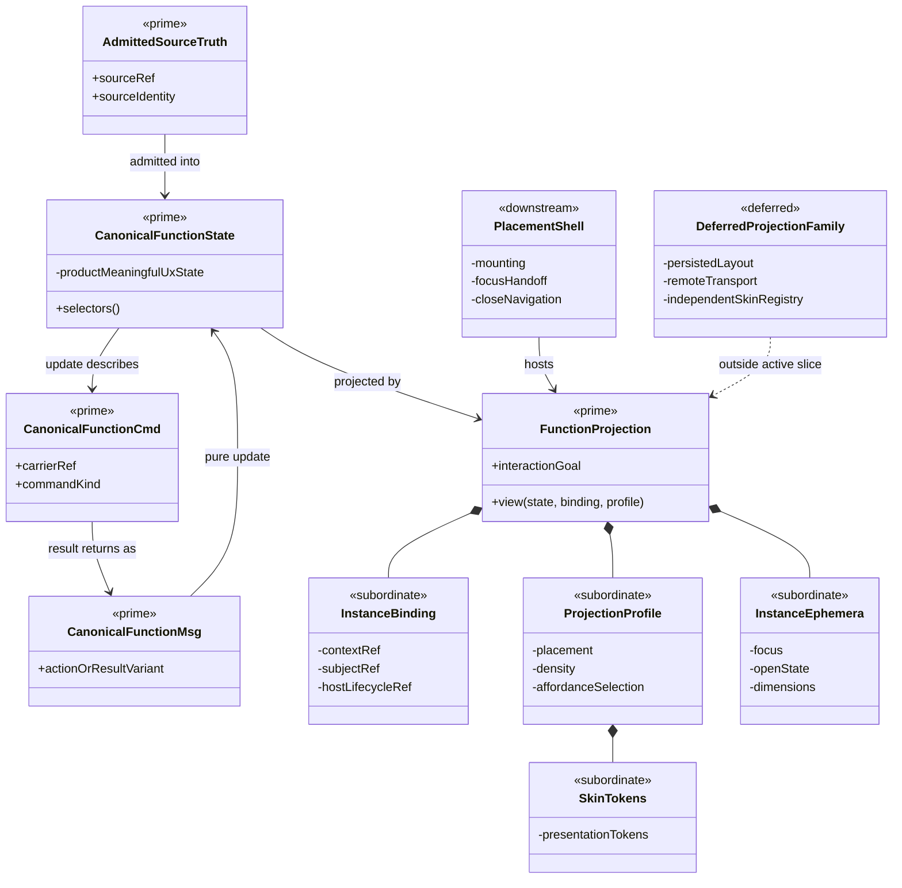

# ADR-001: Canonical UX Functions And Projection Instances

## Context

`odd_manager` presents the same domain capability in several interaction
contexts. A ticket may appear in a workbench tab, an attention flyout, or a
forensic drilldown. Commentary may appear beside a Project, proposal, build,
or run. A document may be rendered inside a review workspace or a compact
supporting panel.

Those placements have different interaction goals, available space, density,
navigation, and emphasis. They require UX adaptation. They do not justify
separate semantic implementations of ticket viewing, commentary, or document
rendering.

Without an explicit boundary, visual reuse can hide semantic duplication:
separate reducers, source interpretation, validation, action rules, and
rendering behavior emerge behind similarly named components. Maintenance and
proof cost then grow with every placement.

## Decision

Each semantic UX function has one authoritative module and one truth path.
That function may be instantiated, wrapped by placement shells, and projected
through multiple UX profiles. Placement and skin change presentation and
interaction ergonomics; they do not create another owner of domain meaning.

```text
admitted source truth
  -> canonical capability state and selectors
  -> canonical Msg / Update / Cmd behavior
  -> named UX projection
  -> context-bound instance
  -> tab | flyout | panel | drilldown
```

Examples:

- one Ticket Viewer function, projected into workbench, flyout, and drilldown
  placements;
- one Commentary function, instantiated against different Context and subject
  references;
- one Document Renderer function, projected with different navigation chrome,
  density, and reading controls.

"One" means one authoritative function and behavior definition. It does not
mean one runtime instance or one visual arrangement.

## Function, Instance, Projection, And Skin

| Term | Meaning | May vary | Must remain singular |
| --- | --- | --- | --- |
| Function | Authoritative domain-facing UX module | Version through admitted design change | Carrier interpretation, State, Msg, Update, Cmd, validation, action law |
| Instance | One binding of the function to Context, subject, and host lifecycle | Context, subject, focus, local ephemera | Function implementation and product truth |
| Projection | Pure view selection for an interaction goal and placement | Information hierarchy, density, visible supporting detail, navigation | Source meaning, status semantics, authority checks, action results |
| Skin | Styling and platform presentation | Tokens, spacing, typography, chrome | State transitions, source interpretation, command behavior |
| Wrapper | Host adapter around a projection instance | Mounting, sizing, focus handoff, close/navigation events | No domain branching, reconstruction, validation, or effects |

A projection profile is subordinate configuration of the canonical function by
default. It does not become a peer module merely because it has a name. A new
top-level projection module must pass the `DESIGN_MODULE_METHOD` Prime Law by
introducing an irreducible projection boundary that cannot be expressed by
composition of the existing function.

## Irreducible Architectural Carrier Set

The smallest carrier family for a canonical UX function is:

| Carrier | Role | Authority | Visibility |
| --- | --- | --- | --- |
| Admitted Source Truth | Existing product or runtime carrier consumed by the function | Authoritative for domain meaning | Public input by reference |
| Canonical Function State | Typed state required to replay the function | Authoritative for the function's product-meaningful UX continuation; never a rival copy of source truth | Module-owned, exposed through selectors |
| Canonical Function Msg | Closed action and result algebra | Authoritative transition input | Public through the function entry |
| Canonical Function Cmd | Declared product effect against an admitted carrier | Effect-edge only | Public to the shared command runtime |
| Function Projection | Pure interaction-goal-specific view model or view function | Downstream only | Public through the function entry |

These are roles, not instructions to create five new generic base types. Each
function reuses existing Project Context, source-carrier, command-envelope, and
host contracts wherever they already carry the role.

The following remain Subordinate Payloads by default:

- instance binding of Context, subject, and host lifecycle;
- projection profile, placement, density, and affordance selection;
- skin tokens and presentation chrome;
- instance-local focus, open state, dimensions, and other lawful ephemera;
- wrapper props and host mounting details.

Independent skin registries, persisted layout carriers, remote projection
transport, and placement-specific semantic modules are deferred families. They
require their own authority and Promotion Test before admission.

## Structural Carrier Diagram



`AdmittedSourceTruth` remains authoritative for domain status and content.
`CanonicalFunctionState` owns only the function's replayable UX continuation
and references or derives source truth; it does not copy domain authority into
a second store.

## UX Governance

UX remains the primary governor of each rendered placement. The interaction
goal determines what is prominent, what can be deferred, and how the function
fits its host. A flyout may be compact and reaction-oriented while a tab is
comparative and persistent.

Every projection still follows `UX_METHOD`:

- `View` is a pure projection of typed state;
- user actions emit the canonical typed `Msg` family;
- product-meaningful state is owned by the function or host reducer;
- effects cross the admitted `Cmd` membrane;
- each placement meets its own keyboard, focus, semantic-structure, and
  responsive obligations.

Instance-local open state, focus, dimensions, and draft display controls may
remain local only when losing them on unmount cannot change product behavior
or another view. Product-meaningful selection, decisions, drafts, and command
posture remain in canonical module or host state.

A compact projection may omit an optional action. It may not weaken the
action's authority, validation, stale-basis, confirmation, or failure semantics
when that action is exposed.

## One-Truth And Compression Rules

For each semantic UX function:

1. One admitted carrier path supplies source truth.
2. One canonical module interprets that truth.
3. One State/Msg/Update/Cmd algebra governs product behavior.
4. Multiple pure projections may derive different view trees.
5. Multiple instances may bind the function to different Context and subject
   identities.
6. Placement wrappers remain authority-neutral.

The following are duplication defects:

- `TicketViewer` and `FlyoutTicketViewer` independently interpreting ticket
  status or actions;
- separate commentary stores or reducers for Project and run placements;
- parsing and interpreting the same document independently in each host;
- a wrapper reconstructing source truth or branching on domain status;
- copying a view and changing it locally instead of declaring a projection;
- a shared visual component above duplicated semantic implementations.

This decision does not require one universal widget. Ticket viewing,
commentary, and document rendering are separate prime functions because they
own different semantic and interaction boundaries. Compression removes rival
implementations; it does not erase real domain boundaries.

## Compression Review Checkpoints

Compression review is part of normal UX iteration:

1. **Design admission**: name the canonical function, admitted source carrier,
   Irreducible Architectural Carrier Set, State/Msg/Update/Cmd owner, and
   intended projections before adding a widget.
2. **Second placement**: before implementing another placement or skin, review
   whether it is an instance or projection of the existing function. Extend the
   canonical module when behavior is shared.
3. **Ticket close**: run the `DESIGN_MODULE_METHOD` post-ticket review across
   the touched boundary. Search for duplicate source interpretation, reducers,
   command families, validators, renderers, and authority-bearing wrappers.
4. **UX sprint close**: reconcile recurrence across all changed capabilities
   and record extraction, extension, or an explicit lawful decision not to
   commonize.

The third local rebuild of the same realization pattern is prohibited unless
the work consumes or extends the governing common function, or records an
explicit design decision explaining why commonization would merge distinct
semantic boundaries.

## Proof Obligations

A function used in multiple placements must prove:

- structural ownership: placements import the canonical public function and do
  not own rival reducers, commands, validators, or source interpreters;
- Msg replay: product behavior from each placement is reproducible through the
  same canonical update algebra;
- projection coherence: the same admitted state retains the same identity,
  status, source references, and action eligibility across projections;
- wrapper neutrality: removing a wrapper removes placement only, not an
  alternative truth or command path;
- instance isolation: local focus and display ephemera do not leak between
  instances, while product-meaningful updates remain coherent;
- per-placement UX proof: layout, text containment, keyboard operation, focus,
  and accessibility are verified for every retained projection.

Visual equality is not required. Semantic coherence and shared authority are.

## Consequences

### Positive

- fixes and policy changes have one semantic implementation;
- new placements become bounded projection work;
- shared proof improves maintenance, resilience, and adaptability;
- UX can evolve by interaction goal without cloning product behavior;
- compression review exposes accidental architecture before it hardens.

### Cost

- projection contracts and instance bindings require deliberate design;
- common functions must avoid placement-specific assumptions;
- changes to a canonical function require regression proof across its retained
  projections;
- regular compression reviews add short-term effort to each iteration.

That review cost is accepted because duplicated semantic widgets create a
larger recurring maintenance and assurance cost.

## Rejected Alternatives

### One implementation per placement

Rejected because tabs, flyouts, panels, and drilldowns would become rival truth
and behavior surfaces.

### One fixed view everywhere

Rejected because interaction goal, space, density, focus behavior, and
accessibility differ by placement. Shared authority does not require identical
presentation.

### A universal generic widget

Rejected because compression must preserve prime domain boundaries. A generic
container may compose functions, but it must not erase the distinct semantics
of tickets, commentary, documents, proposals, builds, or assurance.

## Compliance Gates

- [ ] The semantic UX function has one named authoritative module.
- [ ] Every placement names its interaction goal and projection profile.
- [ ] Placement and skin values remain subordinate unless they pass the Prime
      Law.
- [ ] Wrappers are authority-neutral.
- [ ] All product actions use the canonical Msg/Update/Cmd path.
- [ ] Multiple placements have projection-coherence and Msg-replay proof.
- [ ] Ticket-close and sprint-close compression reviews are recorded.
