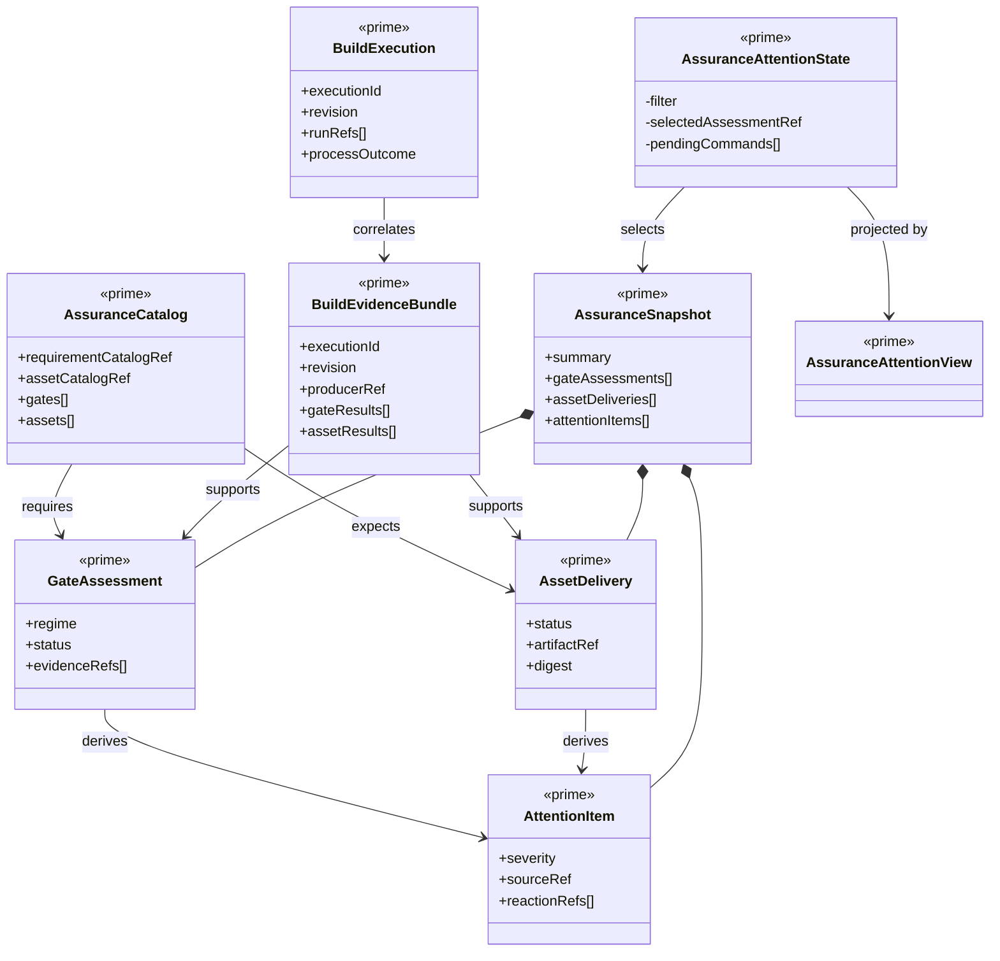

# Assurance And Attention Capability

**Status**: Active
**Wave**: W21 MVP 5
**Ticket**: T-038
**Requirements**: REQ-OM-ASR-001 through REQ-OM-ASR-008
**Governance**: STDO-UX (`DESIGN_MODULE_METHOD`, `UX_METHOD`)
**Common ADR**: `build_tenants/common/design/adrs/ADR-001-canonical-ux-functions-and-projection-instances.md`

## Responsibility

Own one read-only comparison of product-published required gates/assets against
carrier-published evidence for one Project Revision and Build Execution. Derive
evaluator posture, freshness, Attention Items, and bounded reactions. Preserve
source refs and navigate to existing forensic truth.

The capability does not own requirements, execution, ABG evidence admission,
human authority, proof generation, artifact production, or source-condition
resolution.

## Irreducible Architectural Carrier Set

| Carrier | Role | Authority | Visibility |
| --- | --- | --- | --- |
| `AssuranceCatalog` | Product-required gate/asset and reaction semantics | Authoritative product input | Shared public contract |
| `BuildEvidenceBundle` | Adapter-published evidence identity for one execution/revision | Authoritative only after adapter admission | Shared public contract |
| `GateAssessment` | Required gate compared with admitted evidence | Derived assessment | Shared public contract |
| `AssetDelivery` | Expected asset compared with admitted evidence | Derived assessment | Shared public contract |
| `AttentionItem` | One source-attributed unresolved condition | Derived projection | Shared public contract |
| `AssuranceSnapshot` | Replayable matrix and totals | Downstream read model | Shared public contract |
| `AssuranceAttentionState` | Selection, filter, command, and freshness continuation | Capability-owned | Capability public entry |
| `AssuranceAttentionView` | Workbench projection | Downstream only | Capability public projection |

Gate rows, asset rows, evidence checks, summary counts, selected item, filters,
freshness, and error posture are subordinate payloads. Build process state,
ABG traversal, evaluator implementation, evidence files, and authority decisions
remain owned by their source boundaries.

## Structural Carrier Diagram



## Catalog And Evidence Admission

The first Project binding is:

```text
<Project>/.odd/assurance-catalog.json
```

Admission requires schema validity, matching product identity, and exact
requirement/asset catalog refs already published by the admitted Build Carrier
Descriptor. Unknown or absent catalogs are unsupported, never empty success.

An execution adapter may publish one typed evidence bundle under its
manager-owned execution root. The bundle identifies Project, revision,
execution, producer, gate results, asset results, evidence keys, refs, and
digests. The Build supervisor validates identity and schema; Assurance verifies
evidence-file digests before any positive claim.

## Assessment Laws

- no execution means declared requirements remain `required`/`expected`;
- no evidence means an assessed execution remains `missing`;
- mismatched execution, Project, revision, or digest is `stale` or mismatch;
- deterministic failure remains blocking even if an F_H result is positive;
- process exit, terminal-result kind, stdout, and rendered state never satisfy
  a gate or deliver an asset;
- a positive assessment exposes evidence, producer, revision, digest, and
  source refs;
- totals derive from the assessed row set.

## State, Messages, Commands, And Reactions

The canonical reducer owns context/execution selection, matrix loading,
assessment/attention selection, filter, freshness, late-result guards, and
error posture.

```text
assurance.load
supporting-surface.open(run-inspector)
```

Only reaction refs declared by the selected catalog row may render. The first
reaction is forensic inspection in Run Inspector. It changes navigation, not
source truth; the Attention Item remains until a refreshed authoritative source
changes its condition. Future approval, retry, re-entry, or ticket actions must
cross their owning command carriers before being added.

The forensic navigation command carries Project, Build Execution, first
published Run reference, Project revision, and selected evidence source. These
values are URL-addressable and enter Sidecar state as a read-only focus
envelope. They do not create a second run observation or evidence renderer.

## UX Projection

The canonical Workbench projection includes execution/revision/evidence basis,
derived posture and totals, gate and asset matrices, F_D/F_P/F_H regime,
producer/digest/source detail, Attention Items, filters, refresh, selection, and
forensic drill. Unsupported catalogs and missing evidence remain fully visible.

## Compression Review

Assurance has one catalog loader, one evidence adapter boundary, one assessment
service, one State/Msg/Update/Cmd function, one matrix renderer, and one
Attention projection. Portfolio may consume summary/attention counts but may
not reimplement assessment. Run Inspector remains the sole forensic renderer.

## Proof

- converged process with no evidence remains missing;
- complete matching evidence permits positive rows;
- proof digest and revision mismatch remain stale/blocking;
- F_D failure plus F_H satisfaction remains blocking;
- late Project/execution results are rejected;
- navigation reactions are catalog-bounded and do not dismiss attention;
- forensic navigation preserves execution, run, revision, and source context;
- desktop/mobile matrix and detail remain contained.

## Current External Gate

odd_glc does not yet publish its manager-callable Build Carrier Descriptor,
Assurance Catalog, or standard adapter evidence bundle. Dynamic fixture proof
may verify odd_manager assessment behavior but cannot close the odd_glc
data-mapper steel thread.
