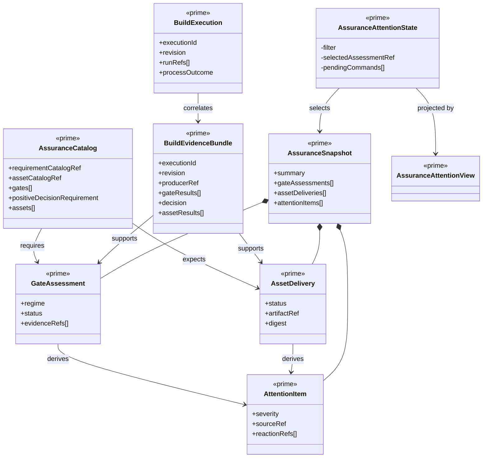

# Assurance And Attention Capability

**Status**: Active
**Wave**: W21 MVP 5
**Ticket**: T-038
**Requirements**: REQ-OM-ASR-001 through REQ-OM-ASR-008
**Governance**: STDO-UX (`DESIGN_MODULE_METHOD`, `UX_METHOD`)
**Implements**: `PO-OM-DEVELOPER-001`; `PO-OM-MODULES-001`; `PO-OM-AUDIT-001`; `REQ-OM-ASR-*`; `REQ-OM-CAP-*`
**Code Entrypoints**: `build_tenants/react_vite/src/capabilities/assurance-attention/index.ts`; `build_tenants/react_vite/src/effects/command-runtime/assurance-attention-command-runtime.ts`; `build_tenants/react_vite/src/server/assurance-service.mjs`; `build_tenants/react_vite/src/server/assurance-catalog-service.mjs`
**Executable Proof**: `build_tenants/react_vite/runtime/tests/test_assurance_attention_replay.mjs` :: `Assurance replay loads one guarded matrix and emits only catalog-admitted forensic reaction`; `build_tenants/react_vite/runtime/tests/test_assurance_attention_replay.mjs` :: `Assurance source-drift refresh retires the command and clears the prior verified snapshot`; `build_tenants/react_vite/runtime/tests/test_assurance_service.mjs` :: `a converged process with no evidence leaves every required gate and asset missing`; `build_tenants/react_vite/runtime/tests/test_assurance_service.mjs` :: `symlinked assurance catalog cannot become Project-published authority`; `build_tenants/react_vite/runtime/tests/test_assurance_service.mjs` :: `unsupported foreign catalog cannot select positive rows or reactions`; `build_tenants/react_vite/tests/e2e/odd-manager-developer-control.spec.ts` :: `Assurance derives missing, verified, and stale posture from catalog and evidence rather than process exit`
**STDO-UX Bindings**: State=AssuranceAttentionState; Msg=AssuranceAttentionMessage; Update=updateAssuranceAttention; Cmd=AssuranceAttentionCommand; Sub=AssuranceAttentionSubscription currently never with refresh command-driven; Ingress=assurance catalog evidence and snapshot schemas in developer-control-contracts; View=AssuranceAttentionView; Membrane=assurance-attention-command-runtime and assurance-service; Replay=build_tenants/react_vite/runtime/tests/test_assurance_attention_replay.mjs :: Assurance replay loads one guarded matrix and emits only catalog-admitted forensic reaction; Accessibility=build_tenants/react_vite/tests/e2e/odd-manager-accessibility.spec.ts :: developer control and workbench tabs provide keyboard parity and named panels
**Accepted Ontology And Design Basis**: `ONT-OM-DEVCTRL-001` and `B-OM-DEVCTRL-LOCAL-001` in the parent design; this module projects `P-OWNERSHIP`, `P-COMMAND`, `P-RESULT`, `P-FAIL-CLOSED`, `P-AUTHORITY`, and `P-EVIDENCE`.
**Accessibility Proof Scope**: Assure navigation, matrix/status semantics, evidence and attention controls, representative contrast, and responsive containment are part of the accepted operator proof bundle.
**Implementation Acceptance**: Accepted for the manager-local assessment projection subject to the exact T-032 validation bundle. A live odd_glc assurance outcome remains unavailable without its published catalog and matching evidence carrier.
**Common ADR**: `build_tenants/common/design/adrs/ADR-001-canonical-ux-functions-and-projection-instances.md`

## Responsibility

Own one read-only comparison of product-published required gates/assets against
carrier-published evidence for one Project Revision and Build Execution. Derive
evaluator posture, freshness, Attention Items, and bounded reactions. Preserve
source refs and navigate to existing forensic truth.

The capability does not own requirements, execution, ABG evidence admission,
human authority, proof generation, artifact production, or source-condition
resolution.

## Irreducible Architectural Carrier Set

| Carrier | Role | Authority | Visibility |
| --- | --- | --- | --- |
| `AssuranceCatalog` | Product-required gate/asset, non-deterministic decision authority/basis, and reaction semantics | Authoritative product input | Shared public contract |
| `BuildEvidenceBundle` | Adapter-published evidence and structured evaluator/human decision identity for one execution/revision | Authoritative only after adapter admission and catalog relation | Shared public contract |
| `GateAssessment` | Required gate compared with admitted evidence | Derived assessment | Shared public contract |
| `AssetDelivery` | Expected asset compared with admitted evidence | Derived assessment | Shared public contract |
| `AttentionItem` | One source-attributed unresolved condition | Derived projection | Shared public contract |
| `AssuranceSnapshot` | Replayable matrix and totals | Downstream read model | Shared public contract |
| `AssuranceAttentionState` | Selection, filter, command, and freshness continuation | Capability-owned | Capability public entry |
| `AssuranceAttentionView` | Workbench projection | Downstream only | Capability public projection |

Gate rows, asset rows, evidence checks, summary counts, selected item, filters,
freshness, and error posture are subordinate payloads. Build process state,
ABG traversal, evaluator implementation, evidence files, and authority decisions
remain owned by their source boundaries.

## Structural Carrier Diagram


```mermaid
classDiagram
  class AssuranceCatalog {
    <<prime>>
    <<authoritative>>
    +requirementCatalogRef
    +assetCatalogRef
    +gates[]
    +positiveDecisionRequirement
    +assets[]
  }
  class BuildExecution {
    <<prime>>
    <<authoritative>>
    +executionId
    +revision
    +runRefs[]
    +processOutcome
  }
  class BuildEvidenceBundle {
    <<prime>>
    <<authoritative-after-admission>>
    +executionId
    +revision
    +producerRef
    +gateResults[]
    +decision
    +assetResults[]
  }
  class GateAssessment {
    <<prime>>
    <<derived>>
    +regime
    +status
    +evidenceRefs[]
  }
  class AssetDelivery {
    <<prime>>
    <<derived>>
    +status
    +artifactRef
    +digest
  }
  class AttentionItem {
    <<prime>>
    <<downstream>>
    +severity
    +sourceRef
    +reactionRefs[]
  }
  class AssuranceSnapshot {
    <<prime>>
    <<downstream>>
    +summary
    +gateAssessments[]
    +assetDeliveries[]
    +attentionItems[]
  }
  class AssuranceAttentionState {
    <<prime>>
    <<authoritative>>
    -filter
    -selectedAssessmentRef
    -pendingCommands[]
  }
  class AssuranceAttentionView {
    <<prime>>
    <<downstream>>
  }

  AssuranceCatalog --> GateAssessment : requires
  AssuranceCatalog --> AssetDelivery : expects
  BuildExecution --> BuildEvidenceBundle : correlates
  BuildEvidenceBundle --> GateAssessment : supports
  BuildEvidenceBundle --> AssetDelivery : supports
  GateAssessment --> AttentionItem : derives
  AssetDelivery --> AttentionItem : derives
  AssuranceSnapshot *-- GateAssessment
  AssuranceSnapshot *-- AssetDelivery
  AssuranceSnapshot *-- AttentionItem
  AssuranceAttentionState --> AssuranceSnapshot : selects
  AssuranceAttentionState --> AssuranceAttentionView : projected by
```

## Catalog And Evidence Admission

The first Project binding is:

```text
<Project>/.odd/assurance-catalog.json
```

Admission requires an exact regular non-symlink Project carrier, schema
validity, matching product identity, and exact requirement/asset catalog refs
already published by the admitted Build Carrier Descriptor. A symlink or
symlink-re-rooted catalog is an admission error, even when its target bytes are
otherwise schema-valid. Unknown or absent catalogs are unsupported, never empty success.
Only `status=ready` admits catalog gate, asset, evidence-key, or reaction
semantics. A schema-valid catalog retained on an `unsupported`, `unavailable`,
or `error` admission is diagnostic input only: it derives no assessment rows,
per-row reactions, or evidence lookup. The one catalog-bound blocking Attention
Item remains the honest projection of that non-ready admission.

Every F_P gate additionally publishes one probabilistic evaluator, authority,
ordered basis, and ordered required fact identity set. Every F_H gate publishes
one required human decision identity and outcome, authority, and ordered basis.
These requirements are independently admitted with the catalog; evidence
cannot create or replace them. F_D gates publish no non-deterministic decision
requirement.

An execution adapter may publish one typed evidence bundle under its
manager-owned execution root. The bundle identifies Project, revision,
execution, producer, gate results, asset results, evidence keys, refs, and
digests. An F_P result may additionally carry one structured probabilistic
decision with evaluator, authority, basis, outcome, and fact outcomes. An F_H
result may carry one structured human decision with decision identity, outcome,
actor, authority, and basis. The Build supervisor validates identity and
schema; Assurance verifies evidence-file digests and the exact catalog relation
before any positive claim.

## Assessment Laws

- no execution means declared requirements remain `required`/`expected`;
- a non-ready catalog derives no satisfied/delivered rows and admits no catalog
  reactions;
- no evidence means an assessed execution remains `missing`;
- mismatched execution, Project, revision, or digest is `stale` or mismatch;
- a digest-valid generic `passed` result satisfies F_D only; it cannot satisfy
  F_P or F_H;
- F_P satisfaction requires exact equality with the catalog-admitted evaluator,
  authority, ordered basis, and ordered required fact identities, a positive
  overall outcome, and a positive outcome for every required fact;
- F_H satisfaction requires the catalog-admitted decision identity and positive
  outcome, an attributable human actor, and exact authority and ordered basis;
- missing human decision remains `waiting_human`; mismatched authority, basis,
  evaluator, decision identity, or fact identity remains non-positive;
- deterministic failure remains blocking even if an F_H result is positive;
- process exit, terminal-result kind, stdout, and rendered state never satisfy
  a gate or deliver an asset;
- a positive assessment exposes evidence, producer, revision, digest, and
  source refs;
- catalog gates and assets map one-to-one to unique assessment identities;
- every non-positive gate or asset derives exactly one source-bound Attention
  Item, and non-ready catalog admission derives exactly one catalog Attention
  Item; missing, duplicate, forged, or extraneous attention is rejected;
- every derived Attention identity uses the shared `assurance:v1` serialization
  law: labeled UTF-16-length-framed Project, present-execution, and source
  components, a distinct `execution:none` variant, and an explicit `gate` or
  `asset` kind; delimiter-bearing exact strings, literal sentinel text,
  identical catalogs, and equal cross-kind source strings cannot collapse;
- totals derive from the assessed row set.

## State, Messages, Commands, And Reactions

The canonical reducer owns context/execution selection, matrix loading,
assessment/attention selection, filter, freshness, late-result guards, and
error posture.

```text
assurance.load
supporting-surface.open(run-inspector)
assurance/command-failed(stale_basis | identity_mismatch)
```

The Assurance command runtime compares every loaded snapshot Project and
ProjectRevision with the exact pending command before publishing
`assurance/load-succeeded`. A drifted or mismatched response publishes the
typed command failure instead. The reducer retires that pending command,
clears any previously positive snapshot, and exposes `stale` or `error`; a
schema-valid but relationally incoherent success is likewise consumed as an
explicit semantic-admission error rather than left pending.
For every satisfied F_P or F_H row, reducer admission independently rechecks
the exact positive decision kind, evaluator or decision identity, positive
outcome, attributable actor, authority, ordered basis, and ordered satisfied
fact set against that row's admitted catalog requirement. Schema validity and
an upstream positive status do not substitute for this reducer-side relation.

Only reaction refs declared by the selected catalog row may render. The first
reaction is forensic inspection in Run Inspector. It changes navigation, not
source truth; the Attention Item remains until a refreshed authoritative source
changes its condition. Future approval, retry, re-entry, or ticket actions must
cross their owning command carriers before being added.

The forensic navigation command carries Project, Build Execution, first
published Run reference, Project revision, and selected evidence source. These
values are URL-addressable and enter Sidecar state as a read-only focus
envelope. They do not create a second run observation or evidence renderer.

## UX Projection

The canonical Workbench projection includes execution/revision/evidence basis,
derived posture and totals, gate and asset matrices, F_D/F_P/F_H regime,
producer/digest/source detail, Attention Items, filters, refresh, selection, and
forensic drill. Unsupported catalogs and missing evidence remain fully visible.

## Compression Review

Assurance has one catalog loader, one evidence adapter boundary, one assessment
service, one State/Msg/Update/Cmd function, one matrix renderer, and one
Attention projection. Portfolio may consume summary/attention counts but may
not reimplement assessment. Run Inspector remains the sole forensic renderer.

## Proof

- converged process with no evidence remains missing;
- complete matching evidence permits positive rows;
- proof digest and revision mismatch remain stale/blocking;
- source drift during refresh retires the pending load and cannot preserve an
  active verified snapshot;
- unsupported foreign catalogs derive no assessment rows or reactions;
- generic digest-valid passed evidence cannot self-certify F_P or F_H;
- missing or mismatched F_P evaluator authority, basis, or exact decision facts
  remains non-positive;
- missing F_H actor/decision or mismatched decision authority/basis remains
  non-positive;
- reducer replay rejects a satisfied F_P/F_H row whose decision kind,
  evaluator/decision identity, outcome, actor, authority, ordered basis, or
  ordered fact outcomes differ from its admitted catalog requirement;
- F_D failure plus F_H satisfaction remains blocking;
- late Project/execution results are rejected;
- navigation reactions are catalog-bounded and do not dismiss attention;
- forensic navigation preserves execution, run, revision, and source context;
- desktop/mobile matrix and detail remain contained.

## Current External Gate

odd_glc does not yet publish its manager-callable Build Carrier Descriptor,
Assurance Catalog, or standard adapter evidence bundle. Dynamic fixture proof
may verify odd_manager assessment behavior but cannot close the odd_glc
data-mapper steel thread.
