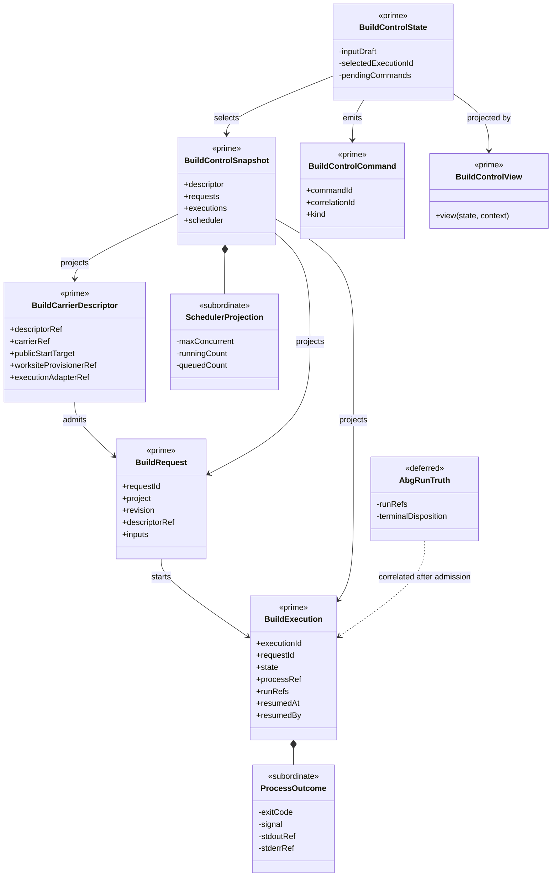

# Build Control Capability

**Status**: Active
**Wave**: W19 MVP 3, W20 MVP 4
**Tickets**: T-036, T-037
**Requirements**: REQ-OM-BLD-001 through REQ-OM-BLD-009
**Governance**: STDO-UX (`DESIGN_MODULE_METHOD`, `UX_METHOD`)
**Common ADR**: `build_tenants/common/design/adrs/ADR-001-canonical-ux-functions-and-projection-instances.md`

## Responsibility

Own build-carrier discovery and admission, typed request admission, immutable
worksite provisioning, bounded queue and external process lifecycle,
Project/revision/run correlation, reconnect, cancellation, and lifecycle
projection.

Build Control does not own graph traversal, runtime retry policy,
continuation, evidence admission, fold, residual, closure, gate meaning, or
assurance. A process outcome remains distinct from ABG and assurance truth.

## Irreducible Architectural Carrier Set

| Carrier | Role | Authority | Visibility |
| --- | --- | --- | --- |
| `BuildCarrierDescriptor` | Published semantic program and adapter identity | Authoritative product input | Shared public contract |
| `BuildExecutionAdapterRegistry` | Digest-pinned server installation of executable adapter functions | Authoritative manager-local configuration | Effect-edge only |
| `BuildRequest` | Immutable attributed request over Project Revision and descriptor | Authoritative manager command record | Shared public contract |
| `BuildExecution` | Durable manager queue/process/run correlation | Authoritative only for manager lifecycle | Shared public contract |
| `BuildControlSnapshot` | Replayable queue and execution projection | Downstream read model | Shared public contract |
| `BuildControlCommand` | Load, submit, attach, cancel effect plan | Effect-edge only | Capability public entry |
| `BuildControlState` | Replayable interaction and command posture | Authoritative only for capability continuation | Capability-owned |
| `BuildControlView` | Workbench projection | Downstream only | Capability public projection |

Subordinate payloads include process outcome, output tail, scheduler counts,
request input draft, selected execution, freshness, and pending command
identity. Adapter process plans, PIDs, log paths, lock files, and worksite copy
details remain effect-edge implementation detail.

## Structural Carrier Diagram



## Descriptor Discovery And Admission

The selected product or installed product binding publishes one
runtime-validated descriptor. The first workspace discovery binding is:

```text
<Project>/.odd/build-carrier.json
```

This is a product binding, not a browser-authored command. A package resolver
may later supply the same descriptor contract without changing Build Control.

Admission requires:

- schema-valid descriptor identity;
- descriptor product identity compatible with selected Project identity;
- `submit` support;
- known allowlisted worksite provisioner ref;
- known allowlisted execution adapter ref;
- no executable, argv, environment, or filesystem path supplied by browser
  input.

Missing descriptor or adapter produces typed `unavailable` or `unsupported`
posture. No shell fallback exists.

Descriptor publication does not install executable authority. Production
adapter installation is a separate manager-local action governed by the
registry below.

## Worksite Provisioning

The manager-owned snapshot provisioner copies the selected exact Project
basis into:

```text
<manager-state>/.ai-workspace/runtime/developer-control/build-worksites/<execution-id>/workspace
```

It excludes repository metadata, dependency caches, generated output, and
runtime state. It observes the Project Revision before and after provisioning;
drift fails before process start. The worksite path is minted by the server and
is never accepted from browser input.

A product may publish another provisioner ref only after it is installed in the
allowlisted server registry and preserves the same immutable-basis contract.

## Supervisor And Adapter Boundary

The durable supervisor stores requests and executions under manager runtime
state. It owns queue slots, external process spawn, PID correlation, stdout and
stderr files, heartbeat, cancellation, restart/reconnect observation, and
process outcome.

An execution adapter is a server-installed function selected only by the
descriptor ref. It maps descriptor, admitted request, and provisioned worksite
to a process plan. The process plan never crosses the browser boundary.

The fixture adapter executes a real bounded Node process for deterministic
manager lifecycle and concurrency proof. It is admitted only under the
explicit Playwright/runtime test environment. It is not odd_glc carrier proof
and cannot close T-036's external dependency.

The future odd_glc adapter must invoke its published non-test ABIogenesis start
contract. The current `node:test` data-mapper harness is not an adapter.

### Production adapter installation

Production execution adapters are installed through one manager-local registry:

```text
<manager-state>/.ai-workspace/runtime/odd_manager/build-execution-adapters.local.json
```

`OMAN_BUILD_ADAPTER_REGISTRY` may select another registry file as an explicit
server-operator binding. A Project descriptor, browser request, prompt, or
portfolio row cannot select the registry file or module path.

Registry shape:

```json
{
  "schemaVersion": "1",
  "adapters": [
    {
      "adapterRef": "execution-adapter://publisher/name/v1",
      "modulePath": "/absolute/operator-installed/adapter.mjs",
      "moduleSha256": "<64 lowercase hexadecimal characters>",
      "exportName": "createBuildExecutionAdapter",
      "sourceRefs": ["adapter-install://publisher/name/v1"]
    }
  ]
}
```

Admission law:

- the registry and adapter module are regular non-symlink files;
- the registry schema is strict and adapter identities are unique;
- every module is SHA-256 pinned before import;
- the exported factory must return the exact registered `adapterRef` plus
  `validateInputs` and `createProcessPlan` functions;
- optional `observeExecution` and `cancelExecution` lifecycle methods remain
  digest-pinned parts of the same adapter and are required when a published
  reconnect or external cancellation path uses them;
- the fixture adapter identity is reserved and cannot enter through production
  configuration;
- any registry, digest, import, export, or identity failure stops the server
  before it admits a Build command.

The adapter factory is trusted executable server code. Trust is conferred by
operator installation plus the registry digest, not by product publication.
Its `validateInputs` result becomes the only admitted request input. Its process
plan remains internal and is schema-validated again by the supervisor.

### Internal process-plan membrane

An admitted adapter process plan must declare an absolute executable, bounded
string arguments, bounded string environment, cwd, manager-minted terminal
result path, and adapter source refs. The supervisor additionally requires:

- cwd is absolute and remains inside the immutable execution worksite;
- terminal result path equals the manager-minted execution result path;
- no `shell`, stdio, detached-process, user, group, or arbitrary spawn option
  crosses the adapter boundary;
- registry and module digest refs join the Build Execution lineage.

Failure occurs before spawn and remains a manager process-admission failure. It
does not become ABG runtime truth.

## State, Messages, Commands, And Refresh

The capability owns descriptor/snapshot loading, input draft, execution
selection, command posture, freshness, output drill, and errors.

Commands:

```text
build.load
build.submit
build.attach
build.cancel
build.resume
```

Every command carries Project root, current revision basis, command identity,
and correlation identity. Submit also carries only parsed declared input and
requester identity. Attach, cancel, and resume carry the named execution
identity and actor.

Success and failure return typed Msg variants. A host subscription adapter
requests snapshot refresh while executions are queued, starting, running,
waiting-human, stale, or disconnected. Late Project, revision, request, and
execution results are rejected by the reducer.

## Lifecycle Semantics

```text
queued -> starting -> running -> converged | failed | cancelled
                         -> waiting_human | stale | disconnected
```

`converged` requires a typed terminal result from the selected execution
adapter. Exit code zero alone is process outcome only. The fixture adapter may
publish its own typed fixture terminal result; it carries no product assurance.

Restart/reconnect reloads the durable execution identity. Formerly active work
first projects `stale`, then `disconnected` after the bounded recovery window.
If the descriptor publishes `resume`, the installed adapter must return a
typed observation for the same execution identity. Resumed external work is
polled through that adapter, and the durable execution records reconnect actor
and time. An observation that remains stale or disconnected fails the command.
Cancellation of a process no longer owned by the current Node process requires
adapter-confirmed cancellation; store mutation alone cannot claim the process
stopped. No connectivity state is silently converted to failed or converged.

## UX Projection

The canonical Build Control projection includes:

- descriptor, carrier, start target, Project Revision, and adapter identity;
- declared JSON input and request attribution;
- scheduler capacity, queued and active counts;
- execution identity, lifecycle, timestamps, process ref, run refs, freshness,
  and process outcome;
- bounded stdout/stderr tail;
- refresh, attach, cancel, carrier-gated reconnect, and Run Inspector
  navigation where lawful.

Build remains a single canonical function under common ADR-001. Portfolio rows
consume its downstream snapshot; they do not reconstruct supervisor truth.

## Current External Gate

odd_glc does not yet publish an admitted descriptor or non-test execution
adapter. Its T-033 declarations-only adoption remains blocked on ABIogenesis
5.0 target promotion and runtime leaves awaiting F_H review. Therefore:

- odd_manager can install a future digest-pinned production adapter without a
  code change, but no odd_glc adapter module is currently published;
- odd_glc Build availability remains fail-closed;
- T-036 cannot claim external/live closure;
- T-039 cannot use the fixture adapter as the data-mapper steel thread.

## Proof

- malformed, missing, product-mismatched, and unknown-adapter descriptors fail
  before request admission;
- missing, malformed, duplicate, digest-drifted, identity-mismatched, and
  reserved-fixture production adapter installs fail closed;
- a digest-pinned external adapter executes through production service with
  fixture mode disabled;
- process plans cannot escape the minted worksite or terminal-result path;
- request schema and exact-basis admission;
- immutable worksite snapshot and drift rejection;
- queued, starting, running, typed terminal, failed, cancelled, stale,
  disconnected, refresh, adapter observation, reconnect, and external
  cancellation lifecycle;
- process outcome remains separate from run and assurance truth;
- reducer Msg replay and cross-Project late-result rejection;
- no browser executable, argv, shell fallback, test-harness, or arbitrary
  worksite path;
- real two-process fixture execution proves supervisor isolation without being
  represented as odd_glc proof.

## Non-Closure Conditions

- the browser supplies executable, argv, environment, or worksite path;
- a generic shell or odd_glc test harness is represented as Build;
- descriptor absence falls back to process execution;
- process exit establishes ABG or assurance truth;
- queue/process state is stored only in React;
- Portfolio reconstructs a second execution store;
- fixture execution is cited as odd_glc data-mapper carrier proof.
