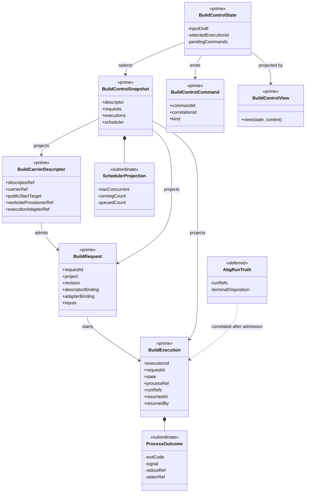

# Build Control Capability

**Status**: Active
**Wave**: W19 MVP 3, W20 MVP 4
**Tickets**: T-036, T-037
**Requirements**: REQ-OM-BLD-001 through REQ-OM-BLD-009
**Governance**: STDO-UX (`DESIGN_MODULE_METHOD`, `UX_METHOD`)
**Implements**: `PO-OM-BOUNDARY-001`; `PO-OM-DEVELOPER-001`; `PO-OM-MODULES-001`; `REQ-OM-BLD-*`; `REQ-OM-CAP-*`
**Code Entrypoints**: `build_tenants/react_vite/src/capabilities/build-control/index.ts`; `build_tenants/react_vite/src/effects/command-runtime/build-control-command-runtime.ts`; `build_tenants/react_vite/src/server/build-control-service.mjs`; `build_tenants/react_vite/src/server/build-execution-adapter-registry.mjs`
**Executable Proof**: `build_tenants/react_vite/runtime/tests/test_build_control_replay.mjs` :: `Build Msg replay carries one typed submit through selection and output attachment`; `build_tenants/react_vite/runtime/tests/test_build_control_service.mjs` :: `descriptor admission fails closed for missing, invalid, mismatched, and uninstalled carriers`; `build_tenants/react_vite/tests/e2e/odd-manager-developer-control.spec.ts` :: `Build Control submits, supervises, attaches, converges, and cancels real fixture processes`
**STDO-UX Bindings**: State=BuildControlState; Msg=BuildControlMessage; Update=updateBuildControl; Cmd=BuildControlCommand; Sub=BuildControlSubscription; Ingress=build descriptor request execution and result schemas in developer-control-contracts; View=BuildControlView; Membrane=build-control-command-runtime and build-control-service; Replay=build_tenants/react_vite/runtime/tests/test_build_control_replay.mjs :: Build Msg replay carries one typed submit through selection and output attachment; Accessibility=build_tenants/react_vite/tests/e2e/odd-manager-accessibility.spec.ts :: developer control and workbench tabs provide keyboard parity and named panels
**Accepted Ontology And Design Basis**: `ONT-OM-DEVCTRL-001` and `B-OM-DEVCTRL-LOCAL-001` in the parent design; this module projects `P-CONTEXT`, `P-COMMAND`, `P-RESULT`, `P-SUBSCRIPTION`, `P-FAIL-CLOSED`, and `P-AUTHORITY`.
**Accessibility Proof Scope**: Build navigation, named availability/status, keyboard access, live output controls, representative contrast, and responsive containment are exercised by the accepted operator proof bundle.
**Implementation Acceptance**: Accepted for the manager-local typed admission and supervision module subject to the exact T-032 validation bundle. The live odd_glc Build operation remains unavailable until odd_glc publishes the required descriptor and adapter; fixture process proof is not that carrier.
**Common ADR**: `build_tenants/common/design/adrs/ADR-001-canonical-ux-functions-and-projection-instances.md`

## Responsibility

Own build-carrier discovery and admission, typed request admission, immutable
worksite provisioning, bounded queue and external process lifecycle,
Project/revision/run correlation, reconnect, cancellation, and lifecycle
projection.

Build Control does not own graph traversal, runtime retry policy,
continuation, evidence admission, fold, residual, closure, gate meaning, or
assurance. A process outcome remains distinct from ABG and assurance truth.

## Irreducible Architectural Carrier Set

| Carrier | Role | Authority | Visibility |
| --- | --- | --- | --- |
| `BuildCarrierDescriptor` | Published semantic program and adapter identity | Authoritative product input | Shared public contract |
| `BuildExecutionAdapterRegistry` | Digest-pinned server installation of executable adapter functions | Authoritative manager-local configuration | Effect-edge only |
| `BuildRequest` | Immutable attributed request over Project Revision, complete descriptor, and installed adapter binding | Authoritative manager command record | Shared public contract |
| `BuildExecution` | Durable manager queue/process/run correlation | Authoritative only for manager lifecycle | Shared public contract |
| `BuildControlSnapshot` | Replayable queue and execution projection | Downstream read model | Shared public contract |
| `BuildControlCommand` | Load, submit, attach, cancel effect plan | Effect-edge only | Capability public entry |
| `BuildControlState` | Replayable interaction and command posture | Authoritative only for capability continuation | Capability-owned |
| `BuildControlView` | Workbench projection | Downstream only | Capability public projection |

Subordinate payloads include process outcome, output tail, scheduler counts,
request input draft, selected execution, freshness, and pending command
identity. Adapter process plans, PIDs, log paths, lock files, and worksite copy
details remain effect-edge implementation detail.

## Structural Carrier Diagram


```mermaid
classDiagram
  class BuildCarrierDescriptor {
    <<prime>>
    <<authoritative>>
    +descriptorRef
    +carrierRef
    +publicStartTarget
    +worksiteProvisionerRef
    +executionAdapterRef
  }

  class BuildRequest {
    <<prime>>
    <<authoritative>>
    +requestId
    +project
    +revision
    +descriptorBinding
    +adapterBinding
    +inputs
  }

  class BuildExecution {
    <<prime>>
    <<authoritative>>
    +executionId
    +requestId
    +state
    +processRef
    +runRefs
    +resumedAt
    +resumedBy
  }

  class ProcessOutcome {
    <<subordinate>>
    -exitCode
    -signal
    -stdoutRef
    -stderrRef
  }

  class SchedulerProjection {
    <<subordinate>>
    -maxConcurrent
    -runningCount
    -queuedCount
  }

  class BuildControlSnapshot {
    <<prime>>
    <<downstream>>
    +descriptor
    +requests
    +executions
    +scheduler
  }

  class BuildControlCommand {
    <<prime>>
    <<effect-edge>>
    +commandId
    +correlationId
    +kind
  }

  class BuildControlState {
    <<prime>>
    <<authoritative>>
    -inputDraft
    -selectedExecutionId
    -pendingCommands
  }

  class BuildControlView {
    <<prime>>
    <<downstream>>
    +view(state, context)
  }

  class AbgRunTruth {
    <<deferred>>
    -runRefs
    -terminalDisposition
  }

  BuildCarrierDescriptor --> BuildRequest : admits
  BuildRequest --> BuildExecution : starts
  BuildExecution *-- ProcessOutcome
  BuildControlSnapshot *-- SchedulerProjection
  BuildControlSnapshot --> BuildCarrierDescriptor : projects
  BuildControlSnapshot --> BuildRequest : projects
  BuildControlSnapshot --> BuildExecution : projects
  BuildControlState --> BuildControlCommand : emits
  BuildControlState --> BuildControlSnapshot : selects
  BuildControlState --> BuildControlView : projected by
  AbgRunTruth ..> BuildExecution : correlated after admission
```

## Descriptor Discovery And Admission

The selected product or installed product binding publishes one
runtime-validated descriptor. The first workspace discovery binding is:

```text
<Project>/.odd/build-carrier.json
```

This is a product binding, not a browser-authored command. A package resolver
may later supply the same descriptor contract without changing Build Control.

Admission requires:

- one regular non-symlink descriptor file at the exact
  `<Project>/.odd/build-carrier.json` path under a realpath-contained
  non-symlink `.odd` directory;
- schema-valid descriptor identity;
- descriptor product identity compatible with selected Project identity;
- `submit` support;
- known allowlisted worksite provisioner ref;
- known allowlisted execution adapter ref;
- no executable, argv, environment, or filesystem path supplied by browser
  input.

Missing descriptor or adapter produces typed `unavailable` or `unsupported`
posture. No shell fallback exists.

Admission freezes the complete validated descriptor and the installed
adapter's digest-bearing source-ref binding into the Build Request. Those
bindings, rather than a later mutable Project descriptor, govern queued start,
reconnect observation, resume, and cancellation for that request. Current
descriptor discovery governs only new request admission and current
availability projection. A same-ref adapter whose installed source binding has
changed is not the admitted adapter and fails closed for existing work.

Descriptor publication does not install executable authority. Production
adapter installation is a separate manager-local action governed by the
registry below.

## Worksite Provisioning

The manager-owned snapshot provisioner copies the selected exact Project
basis into:

```text
<manager-state>/.ai-workspace/runtime/developer-control/build-worksites/<execution-id>/workspace
```

It excludes repository metadata, dependency caches, generated output, and
runtime state. It observes the Project Revision before and after provisioning;
drift fails before process start. The worksite path is minted by the server and
is never accepted from browser input.

`sourceDigest` content-addresses the complete included Project tree, including
tracked, untracked, and otherwise included ignored file bytes plus symlink
targets, using the same exclusion law as the provisioner. Its canonical tuples
distinguish directory, regular-file, and symlink carriers; regular files also
carry executable versus non-executable semantics. Unsupported special files
fail admission. Generated-output exclusions are confined to named Project,
tenant, package, and test-artifact roots, so a lawful nested source directory
such as `src/build` or `src/dist` remains part of the basis and worksite. An
included ignored carrier makes the basis an explicit worktree. A same-path
content, carrier-kind, or executable-semantics change therefore creates a
different Project Revision even when Git porcelain path/status text is
unchanged.

A product may publish another provisioner ref only after it is installed in the
allowlisted server registry and preserves the same immutable-basis contract.

## Supervisor And Adapter Boundary

The durable supervisor stores requests and executions under manager runtime
state. It owns queue slots, external process spawn, PID correlation, stdout and
stderr files, heartbeat, cancellation, restart/reconnect observation, and
process outcome.

An execution adapter is a server-installed function selected only by the
descriptor ref. It maps descriptor, admitted request, and provisioned worksite
to a process plan. The process plan never crosses the browser boundary.

The fixture adapter executes a real bounded Node process for deterministic
manager lifecycle and concurrency proof. It is admitted only under the
explicit Playwright/runtime test environment. It is not odd_glc carrier proof
and cannot close T-036's external dependency.

The future odd_glc adapter must invoke its published non-test ABIogenesis start
contract. The current `node:test` data-mapper harness is not an adapter.

### Production adapter installation

Production execution adapters are installed through one manager-local registry:

```text
<manager-state>/.ai-workspace/runtime/odd_manager/build-execution-adapters.local.json
```

`OMAN_BUILD_ADAPTER_REGISTRY` may select another registry file as an explicit
server-operator binding. A Project descriptor, browser request, prompt, or
portfolio row cannot select the registry file or module path.

Registry shape:

```json
{
  "schemaVersion": "1",
  "adapters": [
    {
      "adapterRef": "execution-adapter://publisher/name/v1",
      "modulePath": "/absolute/operator-installed/adapter.mjs",
      "moduleSha256": "<64 lowercase hexadecimal characters>",
      "exportName": "createBuildExecutionAdapter",
      "sourceRefs": ["adapter-install://publisher/name/v1"]
    }
  ]
}
```

Admission law:

- the registry and adapter module are regular non-symlink files;
- the registry schema is strict and adapter identities are unique;
- every module is read once, SHA-256 verified, and imported from the resulting
  manager-owned exact byte buffer rather than re-opened through its mutable
  installation pathname;
- adapter modules are self-contained ESM carriers: the exact pinned bytes, not
  an unpinned relative dependency graph, establish executable authority;
- the exported factory must return the exact registered `adapterRef` plus
  `validateInputs` and `createProcessPlan` functions;
- optional `observeExecution` and `cancelExecution` lifecycle methods remain
  digest-pinned parts of the same adapter and are required when a published
  reconnect or external cancellation path uses them;
- the fixture adapter identity is reserved and cannot enter through production
  configuration;
- any registry, digest, import, export, or identity failure stops the server
  before it admits a Build command.

The adapter factory is trusted executable server code. Trust is conferred by
operator installation plus the registry digest, not by product publication.
The factory receives only adapter identity and digest provenance, with no
mutable registry or module pathname from which to reacquire authority. Its
`validateInputs` result becomes the only admitted request input. Its process
plan remains internal and is schema-validated again by the supervisor.

### Internal process-plan membrane

An admitted adapter process plan must declare an absolute executable, bounded
string arguments, bounded string environment, cwd, manager-minted terminal
result path, and adapter source refs. The supervisor additionally requires:

- cwd is absolute and remains inside the immutable execution worksite;
- terminal result path equals the manager-minted execution result path;
- no `shell`, stdio, detached-process, user, group, or arbitrary spawn option
  crosses the adapter boundary;
- registry and module digest refs join the Build Execution lineage.

Failure occurs before spawn and remains a manager process-admission failure. It
does not become ABG runtime truth.

## State, Messages, Commands, And Refresh

The capability owns descriptor/snapshot loading, input draft, execution
selection, command posture, freshness, output drill, and errors.

Commands:

```text
build.load
build.submit
build.attach
build.cancel
build.resume
```

Every command carries Project root, current revision basis, command identity,
and correlation identity. Submit also carries only parsed declared input and
requester identity. Attach, cancel, and resume carry the named execution
identity and actor.

Success and failure return typed Msg variants. Reducer admission cross-checks
the exact Project and current command basis, unique snapshot request/execution
identities, request-to-execution correlation and revision, submit requester,
the exact adapter-admitted input repeated by the returned request and snapshot,
descriptor-bound request fields, snapshot membership, attachment
output identity, and the immutable request/correlation/Project/revision/
worksite/attempt identity of an attach, cancel, resume, or optional failure
execution. The reducer does not compare the admitted request input to the raw
pre-admission command input or reimplement adapter normalization; that would
reject lawful defaults and create a second input contract. A host subscription
adapter requests snapshot refresh while executions are queued, starting,
running, waiting-human, stale, or disconnected. Each admitted `build.poll`
dispatches `build/poll-ticked`; the reducer emits at most one `build.load` and
coalesces later timer ticks while that load remains pending. An explicit
refresh or an accepted cancellation/cancellation-acknowledgement arriving
behind that load sets one `refreshQueued` continuation. Repeated explicit or
mutation-driven requests collapse into that same slot. When the older load
succeeds or fails, its result is retired without installation and one fresh
correlated load consumes the slot; periodic ticks never occupy it. Late or
relationally incoherent Project, revision, request, and execution results are
rejected by the reducer.

A durable supervisor store is admitted only when request, execution, and
correlation identities are unique; every request has exactly one execution;
and each execution repeats the exact request Project, Project Revision, and
correlation relation. Load, restart, and every subsequent store commit apply
the same relational validation and fail closed before projecting or acting on
incoherent history.

A submit result must mint request, correlation, and execution identities absent
from the pre-submit snapshot. Snapshot observation time, request time, and all
execution/process/output times are canonical UTC timestamps. Reloaded history
cannot delete a known request, rewrite immutable execution identity, regress
time or lifecycle, or alter a terminal outcome. Scheduler running/queued counts
are global supervisor truth: they must cover at least the Project-local
execution rows, remain within configured limits, and derive exact available
slots without being falsely reconstructed from one Project snapshot.

## Lifecycle Semantics

```text
queued -> starting -> running -> converged | failed | cancelled
                         -> waiting_human | stale | disconnected
```

`converged` requires a typed terminal result from the selected execution
adapter. Exit code zero alone is process outcome only. The fixture adapter may
publish its own typed fixture terminal result; it carries no product assurance.
Waiting-human, converged, failed, and cancelled records carry coherent
completion and process-outcome meaning; non-terminal records cannot borrow a
terminal outcome.

Restart/reconnect reloads the durable execution identity. Formerly active work
first projects `stale`, then `disconnected` after the bounded recovery window.
If the request-bound descriptor publishes `resume`, the exact request-bound
installed adapter must return a typed observation for the same execution
identity. Resumed external work is polled through that adapter, and the durable
execution records reconnect actor and time. Running and typed waiting-human,
converged, or failed observations are durably admitted for that same execution;
an observation that remains stale or disconnected fails the command. A restart
that observes durable `starting`
without a process ref aborts that pre-execution launch as `failed`: the
supervisor starts a same-PID shell gate, durably commits the process identity
by fsyncing the state carrier and its containing directory, and only then
releases the Product executable. Hook failure, store-write failure, or restart
before that commit closes the gate and terminates the blocked child, so no
Product work can have occurred. Cancellation of any process no longer owned by
the current Node process requires request-bound adapter confirmation; store
mutation alone cannot claim the process stopped. No connectivity state is
silently converted to failed or converged.
For a live manager-owned process, accepted signal delivery returns a typed
cancellation acknowledgement that preserves the non-terminal execution and
attributed cancel intent. The reducer retires the cancel command and refreshes.
The attributed cancel intent is durably committed before either local signal
delivery or a request-bound external adapter cancellation call. A failed intent
commit therefore has zero cancellation effect; confirmation is a later durable
transition derived from an observed signal-bearing close or the adapter's typed
result.
Only a later process close carrying an observed termination signal and paired
cancel attribution (or an adapter-confirmed external cancel) may emit the
terminal `build/cancelled` result. A normal close without a termination signal
preserves any typed carrier result even when signal delivery was accepted; it
must not manufacture cancellation.

## UX Projection

The canonical Build Control projection includes:

- descriptor, carrier, start target, Project Revision, and adapter identity;
- declared JSON input and request attribution;
- scheduler capacity, queued and active counts;
- execution identity, lifecycle, timestamps, process ref, run refs, freshness,
  and process outcome;
- bounded stdout/stderr tail;
- refresh, attach, cancel, carrier-gated reconnect, and Run Inspector
  navigation where lawful.

Existing execution supervision remains visible when current descriptor
discovery becomes unavailable or unsupported. Its cancel/resume affordances
derive from the selected request's immutable descriptor binding; only new
submission derives from the current descriptor projection.

Build remains a single canonical function under common ADR-001. Portfolio rows
consume its downstream snapshot; they do not reconstruct supervisor truth.

## Current External Gate

odd_glc does not yet publish an admitted descriptor or non-test execution
adapter. Its T-033 declarations-only adoption remains blocked on ABIogenesis
5.0 target promotion and runtime leaves awaiting F_H review. Therefore:

- odd_manager can install a future digest-pinned production adapter without a
  code change, but no odd_glc adapter module is currently published;
- odd_glc Build availability remains fail-closed;
- T-036 cannot claim external/live closure;
- T-039 cannot use the fixture adapter as the data-mapper steel thread.

## Proof

- malformed, missing, product-mismatched, and unknown-adapter descriptors fail
  before request admission;
- missing, malformed, duplicate, digest-drifted, identity-mismatched, and
  reserved-fixture production adapter installs fail closed;
- mutation of the adapter installation pathname after pinning cannot change the
  exact manager-owned bytes imported for execution;
- a digest-pinned external adapter executes through production service with
  fixture mode disabled;
- process plans cannot escape the minted worksite or terminal-result path;
- request schema and exact-basis admission;
- immutable descriptor and digest-bearing adapter bindings survive mutable
  Project descriptor drift, while same-ref adapter binding drift fails closed;
- immutable worksite snapshot and drift rejection;
- copied worksite symlinks cannot re-root to mutable Project source or excluded
  carriers after rebasing;
- queued, starting, running, typed terminal, failed, cancelled, stale,
  disconnected, refresh, adapter observation, reconnect, and external
  cancellation lifecycle;
- restart refuses duplicate or relationally incoherent request, execution, and
  correlation history;
- cancellation persistence faults prove no local signal or external adapter
  cancellation occurs before durable attributed intent;
- restart, hook failure, and durable-store failure at the launch boundary keep
  Product work behind the same-PID gate, terminate the blocked child, and
  project a typed pre-execution failure without manufacturing Product work;
- process outcome remains separate from run and assurance truth;
- reducer Msg replay and cross-Project late-result rejection;
- no browser executable, argv, shell fallback, test-harness, or arbitrary
  worksite path;
- real two-process fixture execution proves supervisor isolation without being
  represented as odd_glc proof.

## Non-Closure Conditions

- the browser supplies executable, argv, environment, or worksite path;
- a generic shell or odd_glc test harness is represented as Build;
- descriptor absence falls back to process execution;
- process exit establishes ABG or assurance truth;
- queue/process state is stored only in React;
- Portfolio reconstructs a second execution store;
- fixture execution is cited as odd_glc data-mapper carrier proof.
