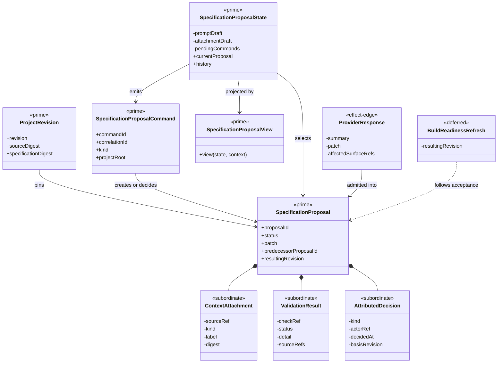

# Specification Proposal Capability

**Status**: Active
**Wave**: W18 MVP 2
**Ticket**: T-035
**Requirements**: REQ-OM-SPC-001 through REQ-OM-SPC-008
**Governance**: STDO-UX (`DESIGN_MODULE_METHOD`, `UX_METHOD`)
**Common ADR**: `build_tenants/common/design/adrs/ADR-001-canonical-ux-functions-and-projection-instances.md`

## Responsibility

Own contextual prompting, proposal lineage, structured diff, deterministic
validation, refinement, explicit accept/reject, resulting revision, and bounded
proposal history. Generated output remains candidate truth until an attributed
acceptance command succeeds against the exact Project Revision basis.

The capability never gives a participant, prompt, view, or placement wrapper
direct write authority over constitutional source.

## Irreducible Architectural Carrier Set

| Carrier | Role | Authority | Visibility |
| --- | --- | --- | --- |
| `ProjectRevision` | Exact source and specification basis | Authoritative existing Context carrier | Shared public input |
| `SpecificationProposal` | Persisted candidate patch, lineage, validation, and decision record | Authoritative for proposal workflow only; never constitutional source | Shared public contract |
| `SpecificationProposalCommand` | Generate, validate, accept, reject, and history effect plan | Effect-edge only | Capability public entry to command runtime |
| `SpecificationProposalState` | Replayable interaction and command posture | Authoritative for capability continuation only | Capability-owned; projected through selectors |
| `SpecificationProposalView` | Interaction-goal projection | Downstream only | Capability public projection |

Subordinate payloads remain nested in those carriers:

- context attachment metadata;
- deterministic validation rows;
- attributed decision detail;
- prompt and refinement drafts;
- diff file, hunk, and line projections;
- pending command identity;
- history retention metadata.

Provider response detail, temporary output paths, lock files, and patch-check
files are effect-edge implementation detail. They are not persisted proposal
truth or public types.

## Structural Carrier Diagram



## Generation And Admission

The default provider adapter invokes `codex exec` with:

- the selected Project as read-only working context;
- an ephemeral session;
- a strict JSON output schema;
- the exact Project Revision and bounded attachment contents;
- an instruction to return one specification-only unified patch without
  editing the Project.

The adapter admits only `summary`, `patch`, and `affectedSurfaceRefs`. The
proposal service validates the patch shape and affected paths before storing a
`draft` proposal. Provider prose, temporary files, and process output do not
become proposal truth.

Tests may inject a deterministic provider at the same adapter boundary. Test
providers do not change the production carrier or command path.

## Persistence And Retention

Proposal history is stored under the manager state root, keyed by a digest of
the selected Project root. It is not written into the target Project and
therefore cannot change the proposal basis merely by recording candidate
truth.

The store retains the latest 50 proposals per Project and reports that limit in
the history projection. Truncation is oldest-first and explicit. Accepted
source remains constitutional authority; proposal history remains workflow
evidence.

## State And Messages

`SpecificationProposalState` owns:

```text
Context and Project Revision basis
prompt and refinement drafts
bounded context attachment refs
current proposal and selected proposal identity
bounded proposal history and retention limit
idle/loading/generating/validating/accepting/rejecting/error posture
pending correlated commands
```

The Msg family is:

```text
proposal/context-changed
proposal/context-attachment-edited
proposal/context-attached { sourceRef? }
proposal/context-removed
proposal/prompt-edited
proposal/generate-requested
proposal/regenerate-requested
proposal/generated
proposal/generate-failed
proposal/validate-requested
proposal/validated
proposal/validation-failed
proposal/refinement-edited
proposal/refine-requested
proposal/accept-requested
proposal/accepted
proposal/accept-failed
proposal/reject-requested
proposal/rejected
proposal/reject-failed
proposal/history-requested
proposal/history-loaded
proposal/history-failed
proposal/selected
proposal/supporting-command-consumed
```

Late results are admitted only when command identity, Project root, and basis
still match the pending command.

`proposal/context-attached` has one semantic meaning with two admitted entry
skins. A manual Attach interaction omits `sourceRef` and consumes the visible
attachment draft. A host attention handoff supplies the already admitted
`sourceRef` directly. Both paths use the same reducer branch, bounded set,
deduplication, removal interaction, and generation command payload. The host
cannot inject prompt text, a patch, or proposal status through this handoff.

When Project Context changes, proposal prompt/refinement drafts, attachment
draft, and attached refs are cleared before the new Project history is loaded.
Same-Project revision refresh may retain explicit context, but no Project may
inherit another Project's candidate interaction state.

Accepted and stale outcomes emit `proposal.refresh-context` through the public
command membrane. The host resolves Project Context from source truth and
acknowledges the supporting command; it does not inspect proposal status to
infer a refresh.

## Deterministic Validation Catalog

Validation precedes acceptance and runs these built-in checks:

1. the current Project and specification digests still equal the proposal
   basis;
2. the patch is non-empty unified Git diff text;
3. every changed path is under `specification/` and remains within the Project;
4. patch whitespace passes deterministic Git checking;
5. `git apply --check` succeeds against the current basis.

An unavailable check is not passing. Any failed or unavailable row leaves the
proposal `invalid` or `stale`; acceptance remains unavailable.

## Atomic Acceptance

Acceptance:

1. acquires one manager-owned proposal lock for the Project;
2. reloads the persisted proposal;
3. requires `valid` status and no non-passing validation rows;
4. re-observes and compares the exact Project and specification basis;
5. reruns `git apply --check`;
6. applies the patch once through `git apply`;
7. observes the resulting Project Revision;
8. persists the attributed accepted decision and resulting revision;
9. releases the lock.

Basis mismatch marks the proposal `stale`, refreshes shared Project Context,
and changes no source. Regeneration invokes the same generation carrier on the
current basis and names the stale proposal as predecessor. The stale record is
not auto-superseded, so the developer can reject it explicitly. Rejection
records an attributed decision and changes no constitutional source.
Refinement creates a new proposal with `predecessorProposalId` and supersedes
the prior non-terminal workflow record without rewriting its candidate patch.

## UX Projection

The canonical capability projection includes:

- bounded attachment entry and removal;
- prompt or refinement input with participant attribution;
- basis and lineage facts;
- file-grouped addition, removal, and context diff lines;
- deterministic validation rows;
- accept, reject, refine, and history actions only when lawful;
- explicit current-basis regeneration for stale proposals;
- accepted resulting revision.

The Workbench tab is the first placement. Any later flyout or drilldown consumes
the same State/Msg/Update/Cmd module under common ADR-001.

## Proof

- shared schemas reject malformed proposal and command payloads;
- service tests prove generate, validate, refine, accept, reject, stale basis,
  bounded history, and no-write-before-acceptance;
- reducer replay proves success, failure, stale/late result, and command gating;
- structural proof confirms one proposal module and one command interpreter;
- browser proof covers context attachment, structured diff, validation,
  refinement lineage, acceptance, rejection, and responsive keyboard use;
- a read-only provider failure returns an explicit failed message and cannot
  mutate target source.

## Non-Closure Conditions

- provider output writes or mutates the target Project directly;
- validation is optional or human-overridable;
- stale proposals are rebased or partially applied;
- proposal history is stored as constitutional source;
- a placement owns a second proposal reducer, validator, store, or renderer;
- acceptance is inferred from UI state or a disappearing diff;
- a fixture provider is represented as production participant proof.
