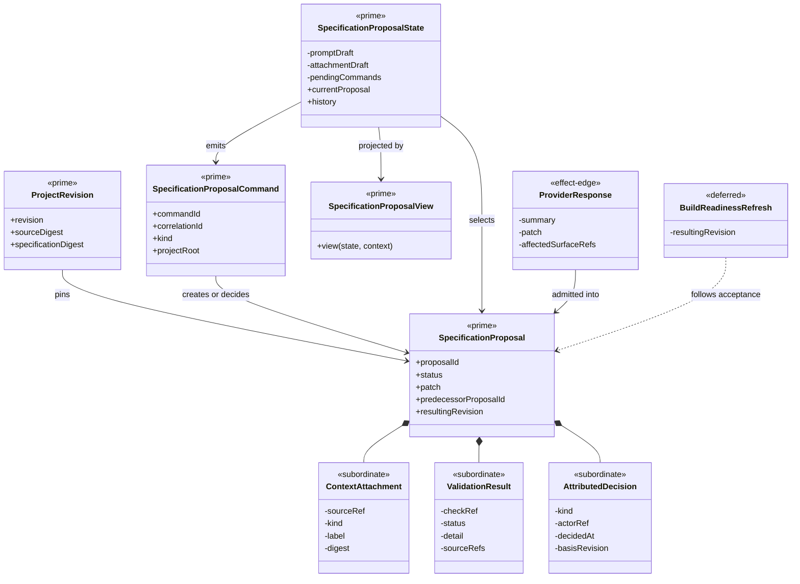

# Specification Proposal Capability

**Status**: Active
**Wave**: W18 MVP 2
**Ticket**: T-035
**Requirements**: REQ-OM-SPC-001 through REQ-OM-SPC-008
**Governance**: STDO-UX (`DESIGN_MODULE_METHOD`, `UX_METHOD`)
**Common ADR**: `build_tenants/common/design/adrs/ADR-001-canonical-ux-functions-and-projection-instances.md`
**Implements**: `PO-OM-DEVELOPER-001`; `PO-OM-MODULES-001`; `PO-OM-AUDIT-001`; `REQ-OM-SPC-*`; `REQ-OM-CAP-*`
**Code Entrypoints**: `build_tenants/react_vite/src/capabilities/specification-proposal/index.ts`; `build_tenants/react_vite/src/effects/command-runtime/specification-proposal-command-runtime.ts`; `build_tenants/react_vite/src/server/specification-proposal-service.mjs`; `build_tenants/react_vite/src/server/specification-proposal-provider.mjs`
**Executable Proof**: `build_tenants/react_vite/runtime/tests/test_specification_proposal_replay.mjs` :: `proposal Msg replay preserves one generate, validate, and accept command path`; `build_tenants/react_vite/runtime/tests/test_specification_proposal_service.mjs` :: `proposal generation, validation, and acceptance preserve candidate truth until one atomic apply`; `build_tenants/react_vite/tests/e2e/odd-manager-developer-control.spec.ts` :: `Specification Proposal generates, refines, validates, accepts, rejects, and preserves lineage`
**STDO-UX Bindings**: State=SpecificationProposalState; Msg=SpecificationProposalMessage; Update=updateSpecificationProposal; Cmd=SpecificationProposalCommand; Sub=SpecificationProposalSubscription currently never with commands result-driven; Ingress=proposal request response decision and history schemas in developer-control-contracts; View=SpecificationProposalView; Membrane=specification-proposal-command-runtime and specification-proposal-service; Replay=build_tenants/react_vite/runtime/tests/test_specification_proposal_replay.mjs :: proposal Msg replay preserves one generate, validate, and accept command path; Accessibility=build_tenants/react_vite/tests/e2e/odd-manager-accessibility.spec.ts :: developer control and workbench tabs provide keyboard parity and named panels
**Accepted Ontology And Design Basis**: `ONT-OM-DEVCTRL-001` and `B-OM-DEVCTRL-LOCAL-001` in the parent design; this module projects `P-CONTEXT`, `P-OWNERSHIP`, `P-COMMAND`, `P-RESULT`, `P-REPLAY`, and `P-AUTHORITY`.
**Accessibility Proof Scope**: Tune navigation, proposal interaction controls, focus/status semantics, representative contrast, and responsive containment are part of the accepted operator proof bundle.
**Implementation Acceptance**: Accepted for the manager-local proposal module subject to the exact T-032 validation bundle. Agent output remains candidate truth until deterministic validation and an explicit admitted decision.

## Responsibility

Own contextual prompting, proposal lineage, structured diff, deterministic
validation, refinement, explicit accept/reject, resulting revision, and bounded
proposal history. Generated output remains candidate truth until an attributed
acceptance command succeeds against the exact Project Revision basis.

The capability never gives a participant, prompt, view, or placement wrapper
direct write authority over constitutional source.

## Irreducible Architectural Carrier Set

| Carrier | Role | Authority | Visibility |
| --- | --- | --- | --- |
| `ProjectRevision` | Exact source and specification basis | Authoritative existing Context carrier | Shared public input |
| `SpecificationProposal` | Persisted candidate patch, lineage, validation, and decision record | Authoritative for proposal workflow only; never constitutional source | Shared public contract |
| `SpecificationProposalCommand` | Generate, validate, accept, reject, and history effect plan | Effect-edge only | Capability public entry to command runtime |
| `SpecificationProposalState` | Replayable interaction and command posture | Authoritative for capability continuation only | Capability-owned; projected through selectors |
| `SpecificationProposalView` | Interaction-goal projection | Downstream only | Capability public projection |

Subordinate payloads remain nested in those carriers:

- context attachment metadata;
- deterministic validation rows;
- attributed decision detail;
- prompt and refinement drafts;
- diff file, hunk, and line projections;
- pending command identity;
- history retention metadata.

Provider response detail, temporary output paths, lock files, and patch-check
files are effect-edge implementation detail. They are not persisted proposal
truth or public types.

## Structural Carrier Diagram


```mermaid
classDiagram
  class ProjectRevision {
    <<prime>>
    <<authoritative>>
    +revision
    +sourceDigest
    +specificationDigest
  }

  class SpecificationProposal {
    <<prime>>
    <<authoritative>>
    +proposalId
    +status
    +patch
    +predecessorProposalId
    +resultingRevision
  }

  class ContextAttachment {
    <<subordinate>>
    -sourceRef
    -kind
    -label
    -digest
  }

  class ValidationResult {
    <<subordinate>>
    -checkRef
    -status
    -detail
    -sourceRefs
  }

  class AttributedDecision {
    <<subordinate>>
    -kind
    -actorRef
    -decidedAt
    -basisRevision
  }

  class SpecificationProposalCommand {
    <<prime>>
    <<effect-edge>>
    +commandId
    +correlationId
    +kind
    +projectRoot
  }

  class SpecificationProposalState {
    <<prime>>
    <<authoritative>>
    -promptDraft
    -attachmentDraft
    -pendingCommands
    +currentProposal
    +history
  }

  class SpecificationProposalView {
    <<prime>>
    <<downstream>>
    +view(state, context)
  }

  class ProviderResponse {
    <<effect-edge>>
    -summary
    -patch
    -affectedSurfaceRefs
  }

  class BuildReadinessRefresh {
    <<deferred>>
    -resultingRevision
  }

  ProjectRevision --> SpecificationProposal : pins
  SpecificationProposal *-- ContextAttachment
  SpecificationProposal *-- ValidationResult
  SpecificationProposal *-- AttributedDecision
  SpecificationProposalCommand --> SpecificationProposal : creates or decides
  SpecificationProposalState --> SpecificationProposal : selects
  SpecificationProposalState --> SpecificationProposalCommand : emits
  SpecificationProposalState --> SpecificationProposalView : projected by
  ProviderResponse --> SpecificationProposal : admitted into
  BuildReadinessRefresh ..> SpecificationProposal : follows acceptance
```

## Generation And Admission

The default provider adapter invokes `codex exec` with:

- the selected Project as read-only working context;
- an ephemeral session;
- a strict JSON output schema;
- the exact Project Revision and bounded attachment contents;
- an instruction to return one specification-only unified patch without
  editing the Project.

The adapter admits only `summary`, `patch`, and `affectedSurfaceRefs`. The
proposal service validates the patch shape and affected paths before storing a
`draft` proposal. Provider prose, temporary files, and process output do not
become proposal truth.

Tests may inject a deterministic provider at the same adapter boundary. Test
providers do not change the production carrier or command path.

## Persistence And Retention

Proposal history is stored under the manager state root, keyed by a digest of
the selected Project root. It is not written into the target Project and
therefore cannot change the proposal basis merely by recording candidate
truth.

The store retains the latest 50 proposals per Project and reports that limit in
the history projection. Truncation is oldest-first and explicit. Accepted
source remains constitutional authority; proposal history remains workflow
evidence.

Each Project has one elected persistence and decision owner. A contender
durably publishes a complete, uniquely named choosing claim, advances that
claim to a held claim with a bakery ticket, and wins only when its `(ticket,
token)` is the lowest active held claim and no other active claim is still
choosing. In-process callers also enter one FIFO lane before that durable
cross-process election.

Fresh malformed legacy claims block. Once aged, malformed, empty, truncated,
or locally abandoned claims may be ignored, but recovery never deletes them.
Parsed live or process-liveness-indeterminate owners continue to block after
aging. Non-regular or unreadable claim carriers are indeterminate and always
block. Release may remove only the exact claim whose process, owner instance,
acquisition time, and token still match the releasing owner; a replaced or
newly published owner is retained.

## State And Messages

`SpecificationProposalState` owns:

```text
Context and Project Revision basis
prompt and refinement drafts
bounded context attachment refs
current proposal and selected proposal identity
bounded proposal history and retention limit
idle/loading/generating/validating/accepting/rejecting/error posture
pending correlated commands
```

The Msg family is:

```text
proposal/context-changed
proposal/context-attachment-edited
proposal/context-attached { sourceRef? }
proposal/context-removed
proposal/prompt-edited
proposal/generate-requested
proposal/regenerate-requested
proposal/generated
proposal/generate-failed
proposal/validate-requested
proposal/validated
proposal/validation-failed
proposal/refinement-edited
proposal/refine-requested
proposal/accept-requested
proposal/accepted
proposal/accept-failed
proposal/reject-requested
proposal/rejected
proposal/reject-failed
proposal/history-requested
proposal/history-loaded
proposal/history-failed
proposal/selected
proposal/supporting-command-consumed
```

Late results are admitted only when command identity, exact Project identity,
and current command basis still match the pending command. Generation results
must also preserve the commanded prompt, predecessor, attachment refs, and
basis. Validate, accept, reject, and optional failure proposal carriers must
name the commanded proposal and preserve its immutable Project, basis,
participant, creation, prompt, patch, attachment, affected-surface, and
predecessor identity. History may span earlier revisions, but every member must
belong to the exact admitted Project and proposal identities must be unique.
Only one proposal command is admitted at a time, so an older history response
cannot race a later validate or decision result. A non-truncated history must
contain every named predecessor; truncated history may name an explicitly
retained predecessor outside the bounded projection. Self-predecessors and
cycles are rejected. A later history observation may advance a non-terminal
record, but it cannot rewrite immutable identity or downgrade an accepted,
rejected, or superseded record.

Provider work may run concurrently, but persistence admits only the elected
Project commit owner. Each commit reloads the latest store, target lifecycle,
and Project basis before merging. Independent root proposals may both persist;
a refinement whose predecessor became accepted, rejected, or superseded is
rejected. Accepted, rejected, and superseded proposals have exhausted their
growth authority and cannot be validated, accepted, rejected, or refined.
Their evidence and donor material cannot select a successor without a fresh,
separately admitted no-predecessor request.

`proposal/context-attached` has one semantic meaning with two admitted entry
skins. A manual Attach interaction omits `sourceRef` and consumes the visible
attachment draft. A host attention handoff supplies the already admitted
`sourceRef` directly. Both paths use the same reducer branch, bounded set,
deduplication, removal interaction, and generation command payload. The host
cannot inject prompt text, a patch, or proposal status through this handoff.

When Project Context changes, proposal prompt/refinement drafts, attachment
draft, and attached refs are cleared before the new Project history is loaded.
Same-Project revision refresh may retain explicit context, but no Project may
inherit another Project's candidate interaction state.

Accepted and stale outcomes emit `proposal.refresh-context` through the public
command membrane. The host resolves Project Context from source truth and
acknowledges the supporting command; it does not inspect proposal status to
infer a refresh.

## Deterministic Validation Catalog

Validation precedes acceptance and runs these built-in checks:

1. the current Project and specification digests still equal the proposal
   basis;
2. the patch is non-empty unified Git diff text;
3. every changed path is under `specification/` and remains within the Project;
4. patch whitespace passes deterministic Git checking;
5. `git apply --check` succeeds against the current basis.

An unavailable check is not passing. Any failed or unavailable row leaves the
proposal `invalid` or `stale`; acceptance remains unavailable.

## Atomic Acceptance

Acceptance:

1. acquires the elected manager-owned proposal claim for the Project and
   reconciles any prior acceptance journal;
2. reloads the persisted proposal, refuses exhausted growth authority, and
   requires `valid` status with no non-passing validation rows;
3. durably records the exact basis, proposal identity, patch, and patch digest
   in a preparing acceptance journal;
4. re-observes the exact Project and specification basis, reruns deterministic
   patch checks, records probing intent, applies the patch as a probe, and
   records the exact expected resulting Project Revision;
5. reverse-checks the probe, durably records rollback intent before removing
   it, then requires restoration of the exact original basis;
6. durably records the attributed accepted carrier and expected result, then
   rechecks the exact basis immediately before the final apply;
7. applies the patch, requires the observed result to equal the probed expected
   Project Revision, and durably records that source-applied phase;
8. atomically persists the accepted proposal, records store commitment, clears
   the journal, and releases only its exact claim.

A normal failure or detected concurrent writer rolls back the candidate patch
only after the manager's apply returned success and reverse applicability
proves its presence. An apply that did not return success never authorizes
reversal of a matching external writer. Candidate absence is rechecked after a
rollback before the journal is cleared. Once the accepted store carrier is
durable, it is the irreversible decision commit point: later journal-write or
cleanup failure retains accepted source and decision truth for recovery rather
than rolling source back.

On restart, journal recovery runs under the same elected claim. Preparing and
ready phases prove no manager mutation is live and never attribute matching
external bytes as acceptance. Probing and applying phases record intent but not
successful mutation: exact basis may clear them, while any non-basis state
retains the journal and blocks without changing source. Probe-applied proves a
successful manager probe and permits entry into a journaled causal rollback.
Every reverse operation first records a reverting phase; exact basis may clear
that phase, while any non-basis state blocks because rollback completion is not
yet durable. Only a durable source-applied or store-committed phase with the
exact expected source result may roll the attributed accepted carrier forward;
a source-applied mismatch may enter the same journaled causal rollback.
Ambiguous source, decision, or patch state retains the journal and blocks
proposal work instead of guessing or weakening acceptance law.

Basis mismatch marks the proposal `stale`, refreshes shared Project Context,
and changes no source. Regeneration invokes the same generation carrier on the
current basis and names the stale proposal as predecessor. The stale record is
not auto-superseded, so the developer can reject it explicitly. Rejection
records an attributed decision and changes no constitutional source.
Refinement creates a new proposal with `predecessorProposalId` and supersedes
the prior non-terminal workflow record without rewriting its candidate patch.

## UX Projection

The canonical capability projection includes:

- bounded attachment entry and removal;
- prompt or refinement input with participant attribution;
- basis and lineage facts;
- file-grouped addition, removal, and context diff lines;
- deterministic validation rows;
- accept, reject, refine, and history actions only when lawful;
- explicit current-basis regeneration for stale proposals;
- accepted resulting revision.

The Workbench tab is the first placement. Any later flyout or drilldown consumes
the same State/Msg/Update/Cmd module under common ADR-001.

## Proof

- shared schemas reject malformed proposal and command payloads;
- service tests prove generate, validate, refine, accept, reject, stale basis,
  bounded history, exhausted-lifecycle refusal, exact claim ownership,
  concurrent-writer rollback, crash recovery, and no-write-before-acceptance;
- an HTTP boundary regression proves accepted, rejected, and superseded
  validate, accept, reject, and refinement requests remain `409` refusals
  through the public route;
- reducer replay proves success, failure, stale/late result, and command gating;
- structural proof confirms one proposal module and one command interpreter;
- browser proof covers context attachment, structured diff, validation,
  refinement lineage, acceptance, rejection, and responsive keyboard use;
- a read-only provider failure returns an explicit failed message and cannot
  mutate target source.

## Non-Closure Conditions

- provider output writes or mutates the target Project directly;
- validation is optional or human-overridable;
- stale proposals are rebased or partially applied;
- proposal history is stored as constitutional source;
- a placement owns a second proposal reducer, validator, store, or renderer;
- acceptance is inferred from UI state or a disappearing diff;
- a fixture provider is represented as production participant proof.
