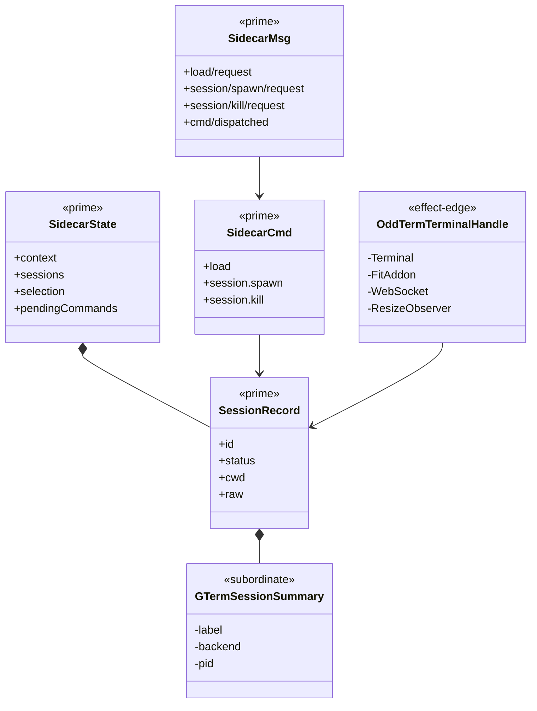

# Design Module - Sidecar Session Workspace OddTerm Port

**Status**: Active
**Date**: 2026-04-27
**Ticket**: B-015
**Tenant**: `react_vite`
**Governance**: STDO-UX (`SPEC_METHOD`, `TICKET_METHOD`, `DESIGN_MODULE_METHOD`, `ODD_METHOD`, `UX_METHOD`)
**Reference Source**: `build_tenants/react_vite/src/features/oddterm/OddTermPanel.tsx`; `build_tenants/react_vite/src/server/oddterm-pool-service.mjs`
**Target Surface**: `build_tenants/react_vite/src/features/sidecar/`

## 1. Purpose

The Sidecar session pane must be ported onto the reliable Local Shell
Workspace substrate without treating the old React widget as authority.

The reference line proves the oddterm runtime carrier:

- `/api/oddterm/session` creates local shell sessions.
- `/api/oddterm` attaches xterm input/output to the selected session.
- the oddterm store preserves session identity, label, pid, backend, and
  transcript references under `.ai-workspace/runtime/`.

The reference line does not govern the target UX realization. Its direct
`useState`, direct async handlers, and xterm/WebSocket controller code are
reference material only.

## 2. Target Boundary

The target boundary is the Sidecar Session Workspace inside `SidecarPanel`.

It consumes the shared `SessionRecord` contract from `src/contracts/session.ts`
and uses an oddterm-backed SessionAsset projection exposed by the server.

Product-meaningful actions are:

- load Sidecar data for the active Project Context
- select a session
- spawn a shell session
- close a shell session
- attach terminal input/output to one selected live session

The UX layer emits typed `Msg` values. The reducer describes typed `Cmd`
values. The effect membrane interprets those commands through HTTP and
WebSocket effects.

## 3. Reference-Derived Mapping

| Reference Material | Target Mapping |
|---|---|
| oddterm session store | preserved as the runtime session carrier |
| `/api/oddterm/session` create/select/close | wrapped by Sidecar session commands and projected as `SessionRecord` |
| `/api/oddterm` WebSocket | used by the terminal effect membrane |
| `GTermSessionSummary` | demoted to `raw` payload on `SessionRecord`; not consumed as Sidecar truth |
| `OddTermPanel` split layout, rename, promote, agent join controls | deferred families outside B-015 |
| view-local action state and direct async handlers | rejected for target; replaced by `State`/`Msg`/`Update`/`Cmd` |

## 4. State / Msg / Update / Cmd

`SidecarState` owns product-meaningful Sidecar state:

- active Context
- Project, Ticket, Comment, and Session projections
- current selection
- unread IDs
- reply draft
- last action result
- pending commands emitted by the reducer

`SidecarMsg` names all user and effect outcomes.

`updateSidecarState` is pure. It never performs I/O.

`describeSidecarCommands` and `reduceSidecarState` are the target
`Update : (Msg, State) -> (State, Cmd)` realization. The React component uses
the reducer result and interprets pending commands in the effect membrane.

## 5. Effect Membrane

The Sidecar effect membrane is bounded to:

- HTTP calls for AssetSurface projections and actions
- xterm.js imperative terminal creation and disposal
- WebSocket attachment to `/api/oddterm`
- `ResizeObserver` and terminal resize messages

The membrane may branch on declared `Cmd` or terminal event type. It must not
derive product meaning outside `State`/`Msg`/`Update`.

## 6. Irreducible Architectural Carrier Set

- `SidecarState` `<<prime>> <<authoritative>>`: current Sidecar UX state.
- `SidecarMsg` `<<prime>> <<authoritative>>`: action and effect outcome algebra.
- `SidecarCmd` `<<prime>> <<authoritative>>`: declared effect algebra.
- `SessionRecord` `<<prime>> <<downstream>>`: shared FE/BE session contract consumed by the Sidecar.
- `OddTermTerminalHandle` `<<effect-edge>>`: xterm/WebSocket platform handles, not product truth.
- `GTermSessionSummary` `<<subordinate>>`: reference runtime payload retained only inside `SessionRecord.raw`.

## 7. Structural Carrier Diagram

## 8. Deferred Families

The following reference features remain outside B-015 and need separate
tickets before retirement of the old Local Shell Workspace:

- split terminal layout
- rename session
- promote terminal tail
- launch Codex/Claude from a shell
- join a room topic from a shell
- font/layout persistence

They are not removed from the old widget in this ticket.

## 9. B-016 Visual Realization Rule

B-016 is a realization refactor over the same target boundary. It does not add
new Sidecar product behavior, message kinds, command kinds, or server effects.

The Sidecar presentation must consume the product's shared design primitives:

- `panel` / `panel--agent-console` for the containing surface
- `summary-pill` for compact context and count state
- `status-chip` for terminal connection state
- `agent-console__terminal-shell`, `agent-console__terminal-bar`, and
  `agent-console__terminal-host` for terminal framing
- app theme variables from `styles.css` for light and dark mode

Local Shell Workspace remains reference material. The lawful import is visual
and ergonomic: terminal shell framing, session action sizing, and compact
session status presentation. Its view-local state pattern, direct effect
handlers, and additional product actions remain outside this Sidecar boundary.

## 10. B-017 Workspace Separation Rule

B-017 splits the Sidecar realization into two Sidecar-owned sub-workspaces:

- `Info Browser`: Project, Ticket, and Comment browsing plus the information
  inspector.
- `Shell Workspace`: session list, spawn/close controls, session metadata, and
  terminal attachment.

The separation is a UX realization rule. It does not create new product
surfaces or new server effects.

Collapse state is part of `SidecarState.ui` and changes only through
`SidecarMsg` replay. The target must not copy the Local Shell Workspace's
view-local `useState` collapse flags. The lawful import is the interaction
shape: each sub-workspace has an expanded form, a collapsed strip, summary
pills, and an independent expand/collapse command.

Shell session selection is independent of the info-browser selection. Selecting
a shell must not clear the selected Project, Ticket, or Comment.

## 11. B-018 Shell Window Layout Rule

B-018 ports the Local Shell Workspace window ergonomics into the Sidecar shell
workspace while keeping the Sidecar method boundary.

The shell workspace must render full-width inside Sidecar:

- session manager as a horizontal strip above terminal windows
- single terminal window layout
- split vertical terminal window layout
- split horizontal terminal window layout
- primary and secondary shell selection represented in `SidecarState`

The shell layout and secondary-window selection are `SidecarMsg` updates and do
not emit `SidecarCmd` effects. Spawn, close, and terminal attach remain the only
shell effects, and they stay inside the existing effect membrane.

## 12. B-019 Route Width Rule

B-019 fixes route containment. The Sidecar route must not inherit the default
two-column `.workspace-view` layout used by inspector-oriented pages. Sidecar is
itself a composed workspace surface and must be mounted in a one-column
full-width route container.

A Sidecar width defect exists when the Sidecar root occupies only the first
workspace grid column while a second implicit column is empty.

## 13. B-020 Legacy Ambient Widget Exclusion Rule

B-020 makes the Sidecar route self-contained. The legacy ambient `OddBoardWidget`
and `OddTermWorkspaceWidget` must not render on the Sidecar route because
Sidecar now owns its own info browser and shell workspace.

This is a route-local exclusion. The ambient widgets remain valid on the other
manager pages until their retirement is designed separately. The Sidecar route
must not initialize their console polling effects solely to hide them with CSS.

## 14. B-021 Rail / Flyout Workbench Rule

B-021 reframes Sidecar as a workbench surface rather than stacked panels.

The layout law is:

- fixed left activity rail chooses the active selection surface
- exactly one selection flyout is visible at a time
- selected object detail renders in the central canvas
- fixed right context rail compresses current context and selection state
- terminal workspace is a horizontal bottom dock

The Projects, Tickets, and Comments selectors must not render as three
simultaneous columns in the main canvas. Rail, flyout, and bottom dock state are
Sidecar `State`/`Msg` replay state, not view-local React state.

## 15. B-022 Compact Chrome / Deep Terminal Rule

B-022 gives Sidecar route-level control of the viewport. Sidecar must not sit
under the full general-purpose Odd Manager hero header. When Sidecar is the
selected page, the app shell presents compact toolbar chrome and gives the
remaining height to the Sidecar workbench.

The compact chrome is route-local. Non-Sidecar pages retain the existing header.

The Sidecar bottom dock must support real shell work. A terminal pane should be
visibly deeper than the shallow preview state and target a practical 25 to 50
line working budget depending on viewport and split mode.

## 16. B-023 Terminal Hide Reclaim Rule

B-023 fixes terminal dock collapse. Hiding the terminal dock must change the
workbench grid allocation, not only remove terminal contents. The collapsed
state must leave a compact Terminal tab visible and return the deep bottom dock
height to the canvas row.

The regression condition is a collapsed terminal dock whose parent grid still
reserves the expanded terminal row.

## 17. B-025 Independent Section Minimize Rule

B-025 restores the original section-operability law: the information browser
and shell workspace are independently minimizable and independently restorable.

Sidecar must always expose persistent section controls outside the section
bodies. A minimized information browser must not rely only on hidden flyout
state for restoration. A minimized shell workspace must not hide every terminal
restore affordance.

The collapse state remains reducer-owned Sidecar Msg state. Minimize and
restore are view projections over that state and must not introduce view-local
state or command effects.

## 18. B-026 Option A Resizable Workbench Rule

B-026 accepts Option A as the next Sidecar direction. Sidecar remains an ODD
Manager-native workbench. VS Code is reference material for workbench
geometry, not source authority and not an adopted runtime.

The workbench carrier model is:

- activity rail: selects the active explorer provider
- explorer panel: renders one contextual provider browser at a time
- viewer groups: tabbed and splittable center panes for inspected assets
- terminal groups: tabbed and splittable bottom panes over the existing xterm
  session substrate
- compact session controls: select and manage sessions without consuming the
  terminal canvas
- layout profile: stores region sizes, split ratios, selected providers, active
  tabs, and collapse state for the current `Context = Project x Workspace`

Resize, split, tab, collapse, restore, and provider selection are Sidecar
State/Msg replay operations. They must not introduce view-local layout truth or
new command effects.

Terminal spawn, close, attach, and I/O remain the shell effect membrane.
Viewer and explorer changes must derive from current project, ticket, comment,
session, and context data rather than introducing a second runtime or editor
authority surface.

## 19. B-027 Layout State And Resize Primitive Rule

B-027 starts the Option A workbench implementation by making region sizing a
typed Sidecar state carrier.

Explorer width, context rail width, and terminal dock height are represented in
`SidecarWorkbenchLayout`. Pointer and keyboard resize controls emit typed
`SidecarMsg` values. The reducer clamps sizes and emits no `SidecarCmd` for
layout-only changes.

The view consumes layout through CSS variables. The CSS must not become the
only source of layout truth.

Resize handles are product controls. They must expose separator semantics,
orientation, accessible names, value state, keyboard operation, and focus
visibility. Pointer capture is host interop only and must not become semantic
layout state.

## 20. B-028 Explorer Provider Registry Rule

B-028 makes the Sidecar explorer a typed provider registry instead of hard-coded
rail buttons.

`SidecarExplorerProvider` is the carrier for explorer provider identity. The
initial registry contains Projects, Tickets, Comments, and Sessions. The left
activity rail renders from this registry. Active provider selection remains
Sidecar reducer state and emits no command effects.

The Sessions provider is a browser projection over admitted `SessionRecord`
state. Selecting a session may update Sidecar selection and active session
through the existing typed message path, but the provider must not spawn, kill,
attach, or perform terminal I/O. Those effects remain in the session and xterm
effect membrane.

Future explorer providers must enter through the registry carrier and must name
their admitted data source or product contract before becoming reachable in the
production Sidecar surface.

## 21. B-029 Viewer Tab And Split Group Rule

B-029 makes the Sidecar center canvas a typed viewer workspace.

`SidecarViewerWorkspace` owns the split mode, active group, viewer groups, and
viewer tabs. `SidecarViewerGroup` owns tab membership and active tab for one
group. `SidecarViewerTab` stores object identity only: object kind and object
id. It must not copy project, ticket, comment, session, or future product
records.

Selecting a Project, Ticket, Comment, or Session opens or activates a viewer
tab in the active viewer group. Viewer tab select, close, split, and focus
changes are Sidecar State/Msg replay operations and must emit no command
effects.

Viewer bodies are projections over admitted Sidecar state. Product-truth
actions inside a viewer body, such as ticket transitions or comment replies,
remain bound to their existing AssetSurface commands. The viewer tab carrier
does not become a second product-truth store.

Viewer tab bars are product controls. They must expose tablist/tab semantics,
accessible close controls, deterministic focus behavior, and replayable state.

## 22. B-030 Terminal Tab And Split Group Rule

B-030 makes the Sidecar bottom dock a typed terminal workspace.

`SidecarTerminalWorkspace` owns the split mode, active group, terminal groups,
and terminal tabs. `SidecarTerminalGroup` owns tab membership and active tab
for one terminal group. `SidecarTerminalTab` stores session identity only:
session id. It must not copy `SessionRecord` bodies or runtime terminal state.

Selecting a shell session opens or activates a terminal tab in the active
terminal group. Terminal tab select, close, split, and focus changes are
Sidecar State/Msg replay operations and must emit no layout command effects.

Terminal panes are projections over admitted `SessionRecord` state and the
existing xterm/WebSocket effect membrane. Spawn, close, attach, terminal input,
and terminal output remain bound to the existing session/runtime commands and
terminal effect edge. The terminal tab carrier does not become a second session
store or a second terminal runtime.

Terminal tab bars are product controls. They must expose tablist/tab semantics,
accessible close controls, deterministic focus behavior, and replayable state.

## 23. B-031 Layout Profile Persistence Rule

B-031 adds a versioned persisted Sidecar layout profile scoped by
`Context = Project x Workspace`.

The persisted profile may carry reducer-owned workbench UI state: collapse
flags, active explorer provider, region sizes, viewer workspace state, terminal
workspace state, and terminal split compatibility state. It must not carry DOM
measurements, React refs, xterm handles, copied product records, session
transcripts, or product action results.

Browser storage is an external payload. It must be parsed and validated before
entering `SidecarState`. Invalid persisted payloads fail closed into typed
messages and must not overwrite current layout state.

Reset-to-default is a Sidecar `Msg` and pure reducer transition. It is not DOM
manipulation and not a browser-storage-only action. The browser effect membrane
may persist the resulting default profile after the reducer accepts the reset.

## 24. B-032 Sidecar Design-Language Grammar

B-032 normalizes the now-working Sidecar workbench into one visual and
interaction grammar. This is a design realization rule. It does not add new
product behavior, new `SidecarMsg` variants, or new `SidecarCmd` effects.

The target follows the VS Code lesson without importing VS Code as authority:
the work area is visually quiet and internally low-border; navigation,
metadata, and command complexity live in sidebars and compact control rails.

The Sidecar grammar is:

- shell chrome gives route-level orientation and global controls
- left activity rail selects one explorer provider
- selection flyout browses one provider at a time
- center canvas contains tabbed viewer groups
- bottom dock contains tabbed terminal groups and compact session controls
- right context rail compresses current context and selection state
- resize handles adjust reducer-owned layout variables

Visual primitives must map to role:

- `sidebar surface`: activity rail, selection flyout, context rail, and compact
  session/control strips
- `workspace area`: center canvas and terminal workspace, kept visually minimal
- `group window`: viewer and terminal split groups with shared tab grammar and
  no card-like framing
- `tab`: viewer and terminal object/session selectors
- `row`: explorer list item or selectable record summary
- `toolbar`: compact command strip
- `chip`: compact status or count metadata
- `detail`: projection of the selected object
- `effect frame`: terminal xterm host and its connection chrome

Sidebar surfaces, control strips, rows, replies, action results, and standalone
detail containers use compact 8px geometry. Smaller nested controls may use
6px. Only chips, unread dots, and resize-handle indicators may use pill
geometry.

Workspace areas and group windows should avoid visible card framing. They may
use hairline tab separators, active tab treatment, and resize gutters, but not
large-radius panels, shadows, or nested bordered cards.

Nested content must not read as cards inside cards. When a detail surface is
rendered inside the center canvas or a pane is rendered inside the selection
flyout, it becomes an unframed projection: no extra border, shadow, or large
radius.

Viewer and terminal tabs share one visual grammar. They may differ in labels
and payload kind, but selected, hover, close, overflow, and focus treatment
must stay equivalent.

Light and dark mode must derive from shared app tokens (`--panel`,
`--panel-strong`, `--line`, `--accent`, `--accent-soft`, `--ink`, `--muted`,
and semantic status tokens). Sidecar must not introduce a separate palette
that drifts from the rest of ODD Manager.

## 25. B-033 Density And Terminal-Flattening Rule

B-033 tightens the B-032 grammar into compact workbench density. This is a
view-realization change only. It does not create new product behavior, new
runtime command effects, or a second terminal/session state carrier.

The density law is:

- global Sidecar chrome must be shallow
- section controls must render as a compact command strip
- canvas header must not duplicate context state already present in the right
  context rail
- empty canvas state must be quiet, not landing-page centered
- terminal dock must expose one compact toolbar before terminal tabs
- terminal tabs and compact session selection are the primary shell selectors
- the actual terminal host must appear after minimal chrome

The terminal dock projection is:

`terminal toolbar -> terminal tab strip -> terminal host`

Allowed subordinate metadata:

- session status
- pid/shell/backend
- compact active-session selector
- spawn action
- split selector
- collapse action
- close/kill action for the active live session

The terminal dock must not reintroduce a separate session-manager panel, a
hidden metadata grid, or a card-like session frame before the terminal host.
Session selection, split, collapse, spawn, and kill still flow through existing
Sidecar `Msg` variants and the existing session/runtime effect membrane.

## 26. B-034 Info-Browser Splitter Density Rule

B-034 applies the B-033 density law to the info-browser viewer splitter. This
is a view-realization change only. It does not create new viewer state, new
runtime effects, or a second tab/split carrier.

The info-browser projection is:

`canvas header with compact split selector -> viewer tab strip -> viewer body`

The split selector is allowed in the canvas header because it is a compact
control over the whole viewer workspace. It must not consume a separate toolbar
row above the viewer tabs.

The selector remains bound to the existing Sidecar `viewer/split` message. The
viewer workspace remains reducer-owned for split mode, active group, active tab,
and tab membership.

The viewer workspace must not reintroduce a `sidecar-viewer-toolbar` layer whose
only purpose is to hold the split selector.

## 27. B-035 Split-Pane Targeting Rule

B-035 makes split-pane targeting explicit. Split groups are not decorative
columns. They are reducer-owned targets for subsequent viewer or terminal
selection.

The targeting law is:

- every viewer group is targetable by pointer and keyboard focus, including
  when it has no active tab
- every terminal group is targetable by pointer and keyboard focus, including
  when it has no active tab
- targeting a viewer group emits `viewer/focus-group`
- targeting a terminal group emits `terminal/focus-group`
- selecting a flyout row opens the object in the active viewer group
- selecting a shell opens the shell in the active terminal group
- spawning a shell carries the active terminal group through the spawn command
  and opens the spawned session in that same group

The terminal selector must render the active terminal group's selected session,
not the global `activeSessionId`, because an empty active terminal group must
render as an empty target.

Action-result feedback is canvas chrome. It must be compact, truncating, and
must not overlap viewer tabs or content.

## 28. B-036 Bottom-Dock Drag Collapse And Restore Rule

B-036 completes the bottom-dock resize primitive. The bottom dock must not hard
stop above a collapse outcome.

The resize law is:

- dragging the bottom-dock resize handle down below the collapse threshold
  collapses the terminal dock
- dragging the collapsed terminal strip up past the restore threshold restores
  the terminal dock
- keyboard resize follows the same threshold law
- threshold crossing is reducer-owned state, not view-local pointer memory
- the collapsed strip keeps a bottom-dock resize handle so restore is possible
  by drag as well as by the existing explicit button

The bottom-dock resize handle remains a `Msg` source. It does not own
continuation and does not store collapse state outside the reducer.

## 29. B-037 Narrow Sweep-Out Context Rail Rule

B-037 preserves the right context rail but changes its projection. The rail is
a narrow context affordance, not a detail column.

The right rail law is:

- the rail stays present in the Sidecar workbench
- the rail is fixed and narrow
- the rail body renders compact symbols and counts only
- full project, selection, unread, and shell detail appears in sweep-out panels
  on hover or keyboard focus
- long project or selection names must not be rendered as horizontal text inside
  the narrow rail
- the rail remains a read-only projection of existing Sidecar state

The right rail does not own context truth and does not introduce new product
commands, reducer transitions, or subscriptions.

## 30. B-040 Multi-Pane Split And Resize Rule

B-040 ports the VS Code pane lesson into Sidecar without importing VS Code as a
runtime dependency. The work area remains low-border. Complexity lives in
compact pane controls and split handles.

The multi-pane law is:

- viewer and terminal workspaces may add vertical panes up to a bounded maximum
- the add-split control is compact pane chrome, not a new large toolbar layer
- each pane remains a reducer-owned target for tabs, focus, and subsequent
  selection
- split ratios are reducer-owned state and participate in layout profile
  persistence
- split handles between adjacent panes are pointer-draggable and
  keyboard-adjustable
- resizing a split boundary adjusts only the adjacent panes
- no split resize may introduce product command effects or subscriptions
- existing single, two-pane vertical, two-pane horizontal, tab, and targeting
  behavior remains lawful

The first realization is wide-monitor vertical growth for viewer and terminal
groups. Horizontal split remains the bounded two-row mode.

## 31. B-072 File Path Clipboard History Rule

B-072 adds a Sidecar operator utility for CLI and agent handoff. File browsing
must produce paste-ready absolute paths and a bounded recent path memory.

The path-memory law is:

- selecting a file from Browse or a pinned folder opens the file in the active
  viewer group and requests a clipboard write for the absolute file path
- the recent path entry records absolute path, Project root, relative path,
  source selector, and timestamp
- duplicate path selections move the existing path to the top rather than
  creating unbounded duplicates
- recent path history is bounded
- a recent path row can re-copy the path
- a recent path row can open the file into the active viewer group when its
  Project root matches the active Context
- copy success or failure is visible through Sidecar action-result feedback

Path-memory state is Sidecar UX/operator state. It is not source-project truth
and does not alter the file, the Project registry, or the active Workspace.

Clipboard writes are effect-edge commands. The reducer may admit the requested
history entry and emit a declared clipboard command, but it must not call the
browser clipboard directly.
